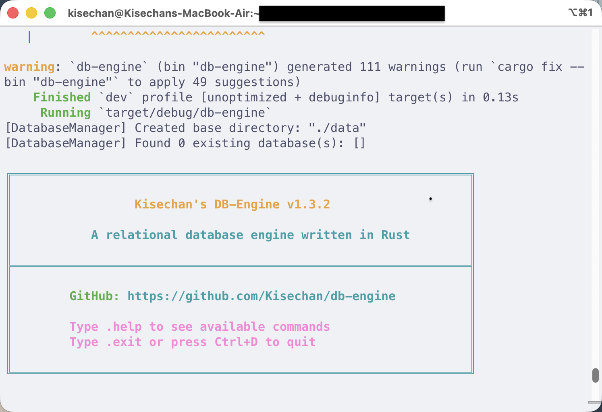

# db-engine

这是吉林大学软件工程卓越工程师班《*数据库系统应用程序开发*》和《*系统软件综合实践*》两门课程（共 3 学分）综合起来共同完成的课程项目。课程的内容主要是了解 [Stanford CS346 课程](https://web.stanford.edu/class/cs346/2015/redbase-pf.html)的 RedBase 框架，仿照实现一个**数据库引擎**的部分功能。

使用 [](https://rust-lang.org/) 实现。

## 功能实现

课程要求实现的数据库主要有**四个基本功能**，具体介绍可以参考我[**博客**](https://blog.kisechan.space/)中的文章，文章中也提供了对应部分的**课程具体要求**，每一部分我也给出了对应的**测试代码**（在 `./src/test/` 路径下）：
1. [**内存、外存和记录管理**](https://blog.kisechan.space/2025/db-engine-1/)，对应 [task1](./src/test/task1.rs) 和 [*task2*](./src/test/task2.rs)（*没有要求做实验验证，所以没有对应代码*）。
2. [**索引**](https://blog.kisechan.space/2025/db-engine-2/)，对应 [task3](./src/test/task3.rs)。
3. [**SQL 处理**](https://blog.kisechan.space/2025/db-engine-3/)，对应 [task4](./src/test/task4.rs)。

在命令行中输入：
```bash
cargo run -- --test
```

可以运行这几个功能对应的测试代码。

## 快速开始

### 环境配置

安装并使用 Rust 工具链（`cargo` / `rustc`）即可。

### 启动交互式数据库（REPL）

```bash
# 开发模式
cargo run

# 生产模式（推荐，性能更好）
cargo run --release

# 启用日志（开发调试）
RUST_LOG=debug cargo run

# 启用日志（生产环境）
RUST_LOG=info cargo run --release
```

启动后会看到欢迎界面，可以输入 SQL 命令进行数据库操作。

### 运行测试

使用下面的命令，可以运行 `task1` ~ `task4` 的测试代码，检查测试结果。

```bash
cargo run -- --test

# 运行测试并查看日志
RUST_LOG=debug cargo run -- --test
```

### 查看帮助

```bash
cargo run -- --help
```

## 日志系统

项目集成了完整的日志系统，支持通过 `RUST_LOG` 环境变量控制日志级别：

```bash
# 开发调试 - 显示详细日志
RUST_LOG=debug cargo run

# 生产环境 - 只显示重要信息
RUST_LOG=info cargo run --release

# 只显示错误
RUST_LOG=error cargo run

# 针对特定模块
RUST_LOG=db_engine::rm=debug cargo run
```

日志级别说明：
- **ERROR**: 错误信息（数据库操作失败、解析错误）
- **WARN**: 警告信息（资源已存在等）
- **INFO**: 重要操作（创建/删除数据库、切换数据库）
- **DEBUG**: 调试信息（SQL 执行、查询计划、优化过程）

## 程序运行示例

交互式界面样式示例如下（截图版本 `v1.3.2`）：



### 交互示例

使用下面的 SQL 语句进行测试：

```sql
CREATE DATABASE testdb;
USE testdb;
SHOW TABLES;
CREATE TABLE users (id INT, name VARCHAR(50), age INT);
INSERT INTO users VALUES (1, 'kisechan', 28);
SELECT * FROM users;
.exit
```

可以得到下面的结果：

```
[DatabaseManager] Created base directory: "./data"
[DatabaseManager] Found 0 existing database(s): []

╔═══════════════════════════════════════════════════════════════╗
║                                                               ║
║                 Kisechan's DB-Engine v1.3.2                   ║
║                                                               ║
║           A relational database engine written in Rust        ║
║                                                               ║
╠═══════════════════════════════════════════════════════════════╣
║                                                               ║
║        GitHub: https://github.com/Kisechan/db-engine          ║
║                                                               ║
║        Type .help to see available commands                   ║
║        Type .exit or press Ctrl+D to quit                     ║
║                                                               ║
╚═══════════════════════════════════════════════════════════════╝


Kisechan's DB-Engine> CREATE DATABASE testdb;
[DatabaseManager] Created database directory: "./data/testdb"
[DatabaseManager] Created empty catalog file: "./data/testdb/catalog.tbl"
[DatabaseManager] Database 'testdb' created successfully
✓ Database 'testdb' created successfully
Kisechan's DB-Engine> USE testdb;
[DatabaseManager] Loading database 'testdb' from "./data/testdb"
[CatalogManager] Catalog page is all zeros, starting with empty schema
[CatalogManager] Initialized with 0 tables, next_table_id=1 (path: "./data/testdb/catalog.tbl")
[CatalogManager] Catalog page is all zeros, starting with empty schema
[CatalogManager] Initialized with 0 tables, next_table_id=1 (path: "./data/testdb/catalog.tbl")
[DatabaseManager] Switched to database 'testdb'
✓ Switched to database 'testdb'
Kisechan's DB-Engine [testdb]> SHOW TABLES;
✓ No tables found in current database
Kisechan's DB-Engine [testdb]> CREATE TABLE users (id INT, name VARCHAR(50), age INT);
[CatalogManager] Added table 'users' to memory cache with table_id=1
[CatalogManager] Flushed 1 tables to disk (126 bytes) at "./data/testdb/catalog.tbl"
[FileHandler] Flushed header to ./data/testdb/users.tbl: size=12 bytes, total_pages=1, free_list_len=0
[TableManager] Created table file: ./data/testdb/users.tbl with initialized header
✓ Table 'users' created successfully
Kisechan's DB-Engine [testdb]> INSERT INTO users VALUES (1, 'kisechan', 28);
[FileHandler] Loaded header from ./data/testdb/users.tbl: total_pages=1, free_list_len=0
[TableManager] Opened table: users
[FileHandler] Allocated new page 1 (total_pages now: 2)
[FileHandler] Flushed header to ./data/testdb/users.tbl: size=12 bytes, total_pages=2, free_list_len=0
[DiskManager] Page 1 beyond file size (4096), returning zero-filled page
✓ 1 row(s) inserted into 'users'
Kisechan's DB-Engine [testdb]> SELECT * FROM users;
[SELECT] Found 1 rows from table 'users'
┌────────┬────┬──────────┬─────┐
│ RID    │ id │ name     │ age │
├────────┼────┼──────────┼─────┤
│ (1, 0) │ 1  │ kisechan │ 28  │
└────────┴────┴──────────┴─────┘

(1 row)
Kisechan's DB-Engine [testdb]> .exit
Goodbye!
[DatabaseManager] Closing all databases...
[CatalogManager] Flushed 1 tables to disk (126 bytes) at "./data/testdb/catalog.tbl"
[DatabaseManager] All databases closed
[DatabaseManager] Closing all databases...
[DatabaseManager] All databases closed
```

## todo 和未完成的部分

下面的功能*也许在可见的未来不会实现*，但是暂时先标出来：

- [x] SQL 解析和 REPL
- [ ] 部分 SQL 语句（如 `UPDATE`）功能的执行逻辑，目前只有解析
- [ ] `SELECT` 子句的聚合函数、子查询、`GROUP BY`、表达式计算
- [ ] 更多数据类型
- [ ] 基于代价的优化
- [ ] 利用索引的优化器
- [ ] SQL 查询缓存
- [ ] 事务管理