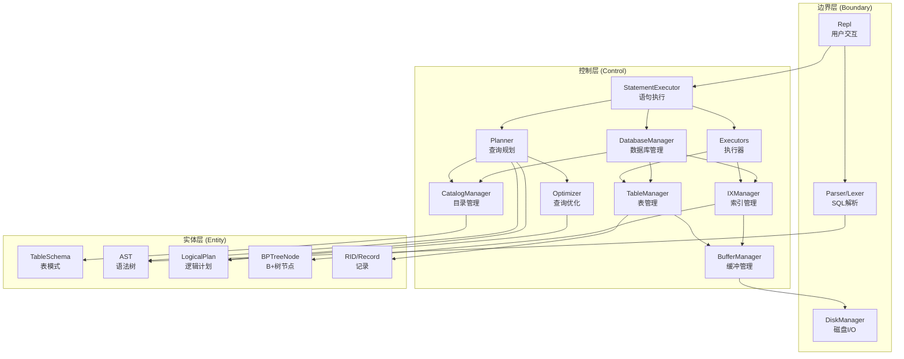
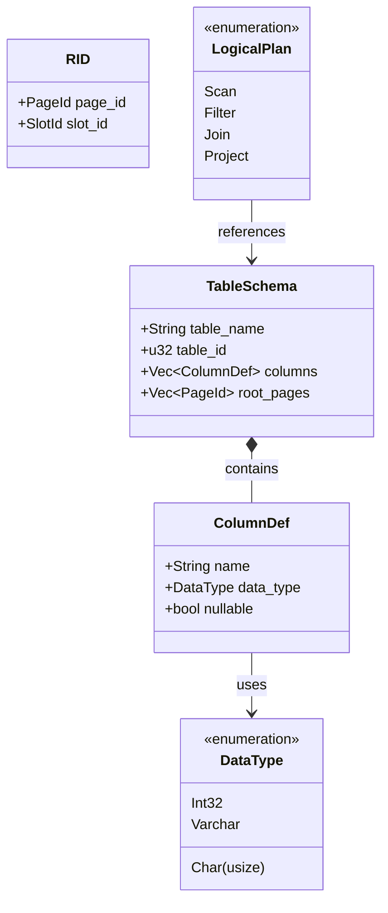
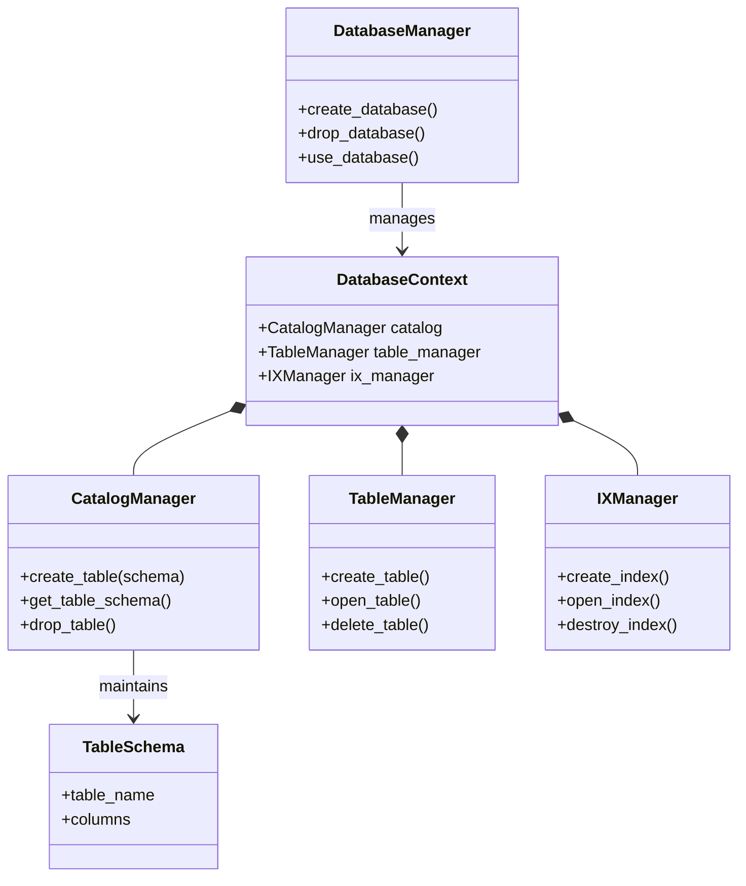
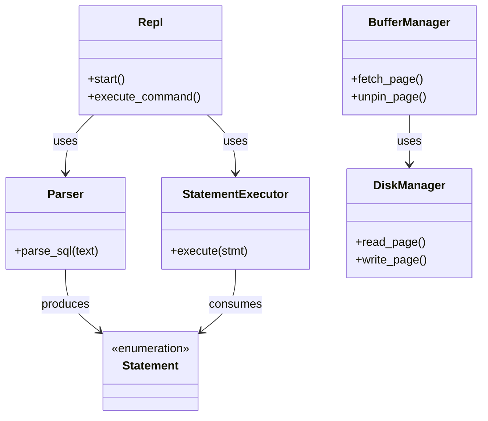

# 分析类的定义

## 实体类

实体类代表系统核心领域模型中的业务对象，包含数据和状态，独立于外部接口和业务逻辑流程。

### 数据库与表

| 实体类 | 职责 | 所在模块 |
|--------|------|----------|
| **`TableSchema`** | 表的元数据定义，包含列定义、表 ID、创建时间等 | `common::types` |
| **`ColumnDef`** | 列定义，包含列名、数据类型、是否可空等属性 | `common::types` |
| **`DataType`** | 数据类型枚举（`Int32`、`Char`、`Varchar` 等） | `common::types` |
| **`DatabaseContext`** | 数据库上下文，封装单个数据库的所有管理器 | `rm::database_manager` |

### 记录与标识

| 实体类 | 职责 | 所在模块 |
|--------|------|----------|
| **`RID`** | 记录标识符，由页号（`PageId`）和槽号（`SlotId`）组成 | `common::types` |
| **`ExecutorRecord`** | 执行器中传递的记录数据结构 | `exec::iterator` |

### 页和文件

| 实体类 | 职责 | 所在模块 |
|--------|------|----------|
| **`FileHeader`** | 文件头元数据，记录总页数、空闲页链表等 | `fm::file_header` |
| **`PageHeader`** | 页头元数据，记录页类型、空闲空间、槽数量等 | `pm::page_header` |
| **`Frame`** | 缓冲区中的一页数据，包含 `pin` 计数、脏页标记等 | `mm::frame` |

### 索引与 B+ 树

| 实体类 | 职责 | 所在模块 |
|--------|------|----------|
| **`BPTreeNode`** | B+ 树节点，封装内部节点和叶子节点的数据结构 | `ix::node` |

### SQL 抽象语法树（AST）

| 实体类 | 职责 | 所在模块 |
|--------|------|----------|
| **`Statement`** | SQL 语句根节点（枚举：`Select`、`Insert`、`CreateTable` 等） | `sql::ast` |
| **`SelectStmt`** | `SELECT` 语句的 AST 节点 | `sql::ast` |
| **`InsertStmt`** | `INSERT` 语句的 AST 节点 | `sql::ast` |
| **`CreateTableStmt`** | `CREATE TABLE` 语句的 AST 节点 | `sql::ast` |
| **`Expression`** | 表达式节点（列引用、字面量、运算符等） | `sql::ast` |

### 查询计划

| 实体类 | 职责 | 所在模块 |
|--------|------|----------|
| **`LogicalPlan`** | 逻辑查询计划节点（`Scan`、`Filter`、`Join`、`Project` 等） | `plan::logical` |
| **`PhysicalPlan`** | 物理查询计划 | `plan::physical` |

## 边界类

边界类负责处理系统与外部环境的交互，包括用户界面、文件 I/O、磁盘访问等。

### 用户交互

| 边界类 | 职责 | 所在模块 |
|--------|------|----------|
| **`Repl`** | 交互式命令行界面，处理用户输入、显示查询结果 | `repl` |

### SQL 解析

| 边界类 | 职责 | 所在模块 |
|--------|------|----------|
| **`Lexer`** | 词法分析器，将 SQL 文本切分为 Token 流 | `sql::lexer` |
| **`Parser`** | 语法分析器，将 Token 流解析为 AST | `sql::parser` |

### 磁盘与文件 I/O

| 边界类 | 职责 | 所在模块 |
|--------|------|----------|
| **`DiskManager`** | 底层磁盘 I/O 管理，负责页的读写操作 | `common::disk_manager` |
| **`FileHandler`** | 文件级操作，管理文件头、页分配与回收 | `fm::file_handler` |
| **`FileManager`** | 高级文件管理，负责文件创建、删除、打开 | `fm::file_manager` |

---

## 控制类

控制类协调业务逻辑，管理实体类的生命周期，实现系统的核心功能流程。

### 数据库与表管理

| 控制类 | 职责 | 所在模块 |
|--------|------|----------|
| **`DatabaseManager`** | 多数据库生命周期管理，创建/删除/切换数据库 | `rm::database_manager` |
| **`CatalogManager`** | 数据字典管理，维护表模式的注册、查询与持久化 | `rm::catalog_manager` |
| **`TableManager`** | 表管理，创建/删除/打开表文件 | `rm::table_manager` |
| **`RecordManager`** | 记录级操作，负责插入、删除、更新记录（待实现） | `rm::record_manager` |
| **`TableHandler`** | 表数据访问，提供记录的插入、扫描等接口 | `rm::table_handler` |

### 索引管理

| 控制类 | 职责 | 所在模块 |
|--------|------|----------|
| **`IXManager`** | 索引生命周期管理，创建/删除/打开索引 | `ix::ix_manager` |
| **`IXHandler`** | 单个索引的操作接口，封装 B+ 树插入、删除、查询 | `ix::ix_handler` |
| **`IXScan`** | 索引范围扫描迭代器 | `ix::scan` |

### 内存与缓冲管理

| 控制类 | 职责 | 所在模块 |
|--------|------|----------|
| **`BufferManager`** | 缓冲区管理，实现页的缓存、淘汰策略 | `mm::buffer_manager` |
| **`Replacer`** | 页替换策略（LRU 等） | `mm::replacer` |

### 查询执行与优化

| 控制类 | 职责 | 所在模块 |
|--------|------|----------|
| **`StatementExecutor`** | 语句执行器，协调 DDL/DML 语句的执行流程 | `exec::statement_executor` |
| **`Planner`** | 查询规划器，将 AST 转换为逻辑计划 | `plan::planner` |
| **`Optimizer`** | 查询优化器，对逻辑计划进行优化（谓词下推等） | `plan::optimizer` |
| **`PhysicalPlanner`** | 物理计划生成器，将逻辑计划转换为可执行的物理计划 | `plan::physical` |

### 执行引擎（火山模型）

| 控制类 | 职责 | 所在模块 |
|--------|------|----------|
| **`SeqScanExecutor`** | 全表扫描执行器 | `exec::scan` |
| **`FilterExecutor`** | 过滤执行器 | `exec::filter` |
| **`NestedLoopJoinExecutor`** | 嵌套循环连接执行器 | `exec::join` |

### 其他

| 控制类 | 职责 | 所在模块 |
|--------|------|----------|
| **`TransactionLogger`** | 事务日志管理 | `rm::transaction_logger` |

---

## 系统架构图

### 整体架构

---

## 分析类的交互模式

### 实体类之间的组合关系

### 控制类管理实体类

### 边界类与控制类协作

