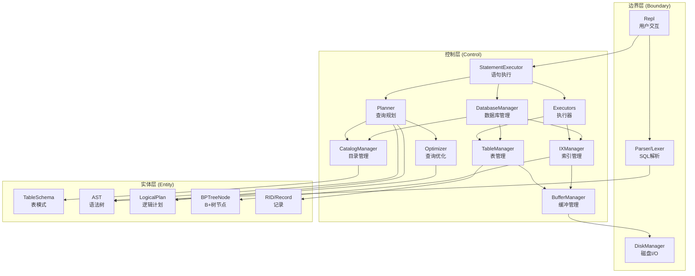
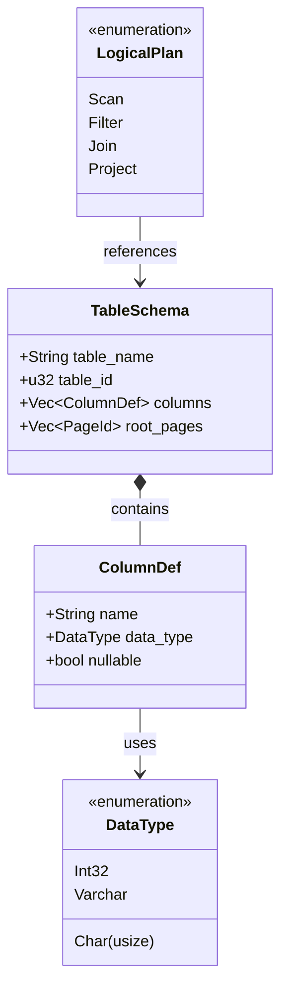
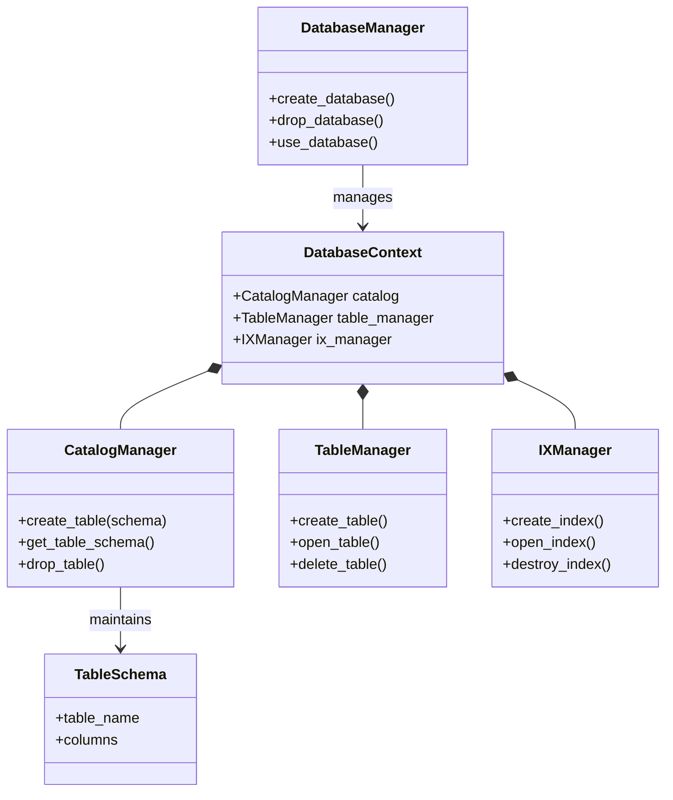
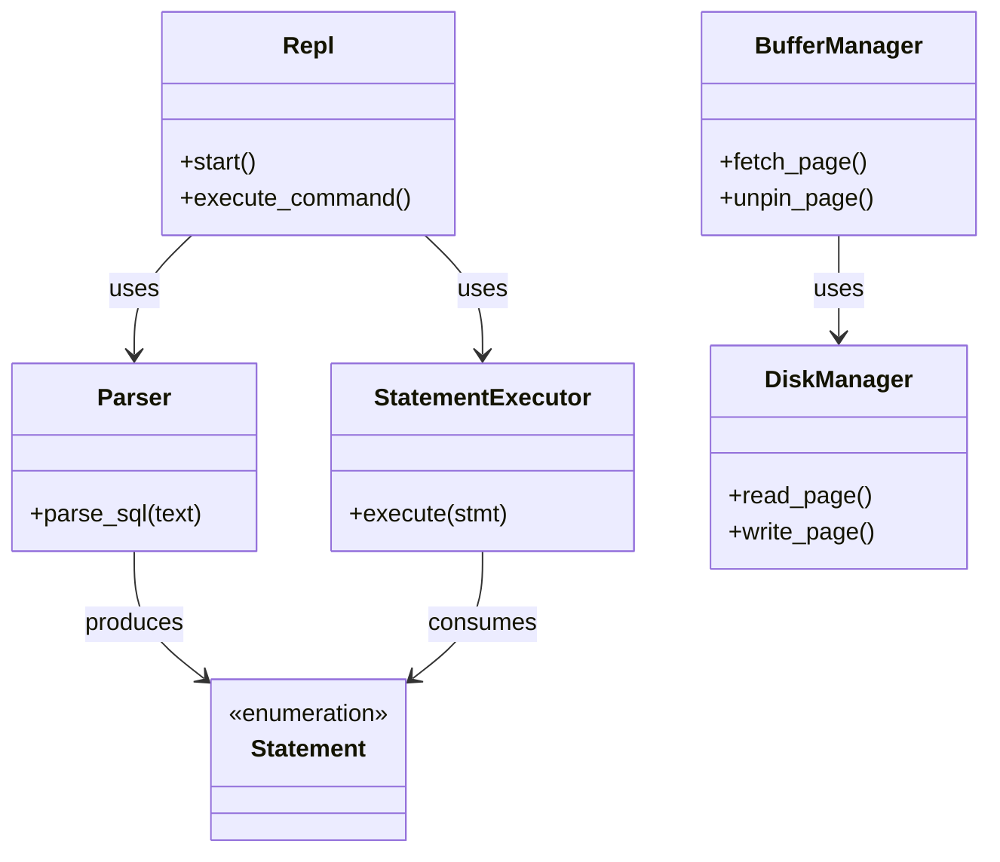

# 分析类的定义

## 实体类

实体类代表系统核心领域模型中的业务对象，包含数据和状态，独立于外部接口和业务逻辑流程。

### 数据库与表

| 实体类 | 职责 | 所在模块 |
|--------|------|----------|
| **`TableSchema`** | 表的元数据定义，包含列定义、表 ID、创建时间等 | `common::types` |
| **`ColumnDef`** | 列定义，包含列名、数据类型、是否可空等属性 | `common::types` |
| **`DataType`** | 数据类型枚举（`Int32`、`Char`、`Varchar` 等） | `common::types` |
| **`DatabaseContext`** | 数据库上下文，封装单个数据库的所有管理器 | `rm::database_manager` |

```rust
// 数据类型枚举
#[derive(Serialize, Deserialize, Debug, Clone, PartialEq)]
pub enum DataType {
    Int32,
    // 定长字符串（fixed length）
    Char(usize),
    // 变长字符串（VARCHAR）
    Varchar,
  
    // ...
}

// 列定义
#[derive(Serialize, Deserialize, Debug, Clone)]
pub struct ColumnDef {
    pub name: String,
    pub data_type: DataType,
    pub nullable: bool,
}

// 表模式（Schema）
#[derive(Serialize, Deserialize, Debug, Clone)]
pub struct TableSchema {
    pub table_name: String,
    pub table_id: u32,                      // 表的唯一标识 ID
    pub columns: Vec<ColumnDef>,
    pub root_pages: Vec<PageId>,            // 初始/主数据页（可为空）
    pub create_time: u64,                   // 创建时间戳（秒）
    pub row_count: u64,                     // 表中的记录数
    pub last_modified: u64,                 // 最后修改时间戳（秒）
}

impl TableSchema {
    // 计算一条记录的固定长度（字节）
    pub fn calculate_fixed_record_size(&self) -> usize {
        self.columns
            .iter()
            .map(|col| match col.data_type {
                DataType::Int32 => 4,
                DataType::Char(len) => len,
                DataType::Varchar => 0, // VARCHAR 使用变长指针
            })
            .sum()
    }

    // 获取当前时间戳
    pub fn current_timestamp() -> u64 {
        SystemTime::now()
            .duration_since(UNIX_EPOCH)
            .map(|d| d.as_secs())
            .unwrap_or(0)
    }
}

// 数据库上下文，包含单个数据库的所有管理器
pub struct DatabaseContext {
    pub name: String,
    pub path: PathBuf,
    pub catalog: CatalogManager,
    pub table_manager: TableManager,
    pub ix_manager: IXManager,
}
```

### 记录与标识

| 实体类 | 职责 | 所在模块 |
|--------|------|----------|
| **`RID`** | 记录标识符，由页号（`PageId`）和槽号（`SlotId`）组成 | `common::types` |
| **`ExecutorRecord`** | 执行器中传递的记录数据结构 | `exec::iterator` |

```rust
pub type PageId = u32;
pub type SlotId = u16;
pub const PAGE_SIZE: usize = 4096;

// 记录标识符 = 页号 + 槽号
#[derive(Clone, Copy, Debug, Deserialize, Serialize)]
pub struct RID {
    pub page_id: PageId,
    pub slot_id: SlotId,
}

// 执行器记录类型
// 包含 RID（用于后续定位）和数据字节流
#[derive(Debug, Clone)]
pub struct ExecutorRecord {
    pub rid: RID,
    pub data: Vec<u8>,
}
```

### 页和文件

| 实体类 | 职责 | 所在模块 |
|--------|------|----------|
| **`FileHeader`** | 文件头元数据，记录总页数、空闲页链表等 | `fm::file_header` |
| **`PageHeader`** | 页头元数据，记录页类型、空闲空间、槽数量等 | `pm::page_header` |
| **`Frame`** | 缓冲区中的一页数据，包含 `pin` 计数、脏页标记等 | `mm::frame` |

```rust
#[derive(Serialize, Deserialize, Clone, Debug)]
pub struct FileHeader {
    pub total_pages: u32,        // 文件总页数
    pub free_list: Vec<PageId>,  // 空闲页列表
}

impl Default for FileHeader {
    fn default() -> Self {
        FileHeader {
            total_pages: 1, // 第 0 页是header本身
            free_list: Vec::new(),
        }
    }
}

#[derive(Default, Clone, Copy)]
pub struct PageHeader {
    pub free_space_offset: u16,  // 数据区空闲空间起始位置（从高地址向下增长）
    pub slot_count: u16,         // slot table 总条目数（包括已删除的）
    pub free_slot_head: u16,     // 空闲 slot 链表头 (u16::MAX 表示无)
}

impl PageHeader {
    pub const SIZE: usize = 6; // 3 * u16

    pub fn serialize(&self) -> [u8; Self::SIZE] {
        let mut data = [0u8; Self::SIZE];
        data[0..2].copy_from_slice(&self.free_space_offset.to_le_bytes());
        data[2..4].copy_from_slice(&self.slot_count.to_le_bytes());
        data[4..6].copy_from_slice(&self.free_slot_head.to_le_bytes());
        data
    }

    pub fn deserialize(data: &[u8]) -> Result<Self, String> {
        if data.len() < Self::SIZE {
            return Err("Invalid page header data".to_string());
        }
        Ok(PageHeader {
            free_space_offset: u16::from_le_bytes([data[0], data[1]]),
            slot_count: u16::from_le_bytes([data[2], data[3]]),
            free_slot_head: u16::from_le_bytes([data[4], data[5]]),
        })
    }

    // 检查是否有空闲 slot
    pub fn has_free_slot(&self) -> bool {
        self.free_slot_head != u16::MAX
    }
}

#[derive(Clone)]
pub struct Frame {
    pub page_id: PageId,
    pub data: Vec<u8>,
    pub pin_count: u32,
    pub is_dirty: bool,
}

impl Frame {
    pub fn new(page_size: usize) -> Self {
        Frame {
            page_id: u32::MAX, // 初始化为无效页号
            data: vec![0u8; page_size],
            pin_count: 0,
            is_dirty: false,
        }
    }
}
```

### 索引与 B+ 树

| 实体类 | 职责 | 所在模块 |
|--------|------|----------|
| **`BPTreeNode`** | B+ 树节点，封装内部节点和叶子节点的数据结构 | `ix::node` |

```rust
#[derive(Debug, Clone)]
pub struct BPTreeNode {
    pub page_id: PageId,
    pub is_leaf: bool,
    pub keys: Vec<Vec<u8>>,      // key 二进制存储
    pub rids: Vec<(u32, u16)>,   // 叶子节点存 RID (page, slot)
    pub children: Vec<PageId>,   // 内部节点子指针
    pub next_leaf: Option<PageId>,
}

impl BPTreeNode {
    pub fn new(page_id: PageId, is_leaf: bool) -> Self {
        Self {
            page_id,
            is_leaf,
            keys: vec![],
            rids: vec![],
            children: vec![],
            next_leaf: None,
        }
    }

    // 序列化 BPTreeNode 到字节数组
    // 
    // 格式（字节偏移）：
    // [0] is_leaf (1字节，bool)
    // [1-4] key_count (4字节，u32)
    // [5-8] next_leaf (4字节，u32，Option<PageId>，0表示None)
    // [9+] 数据部分（变长）
    //   对于叶子节点：
    //       每个 key 存储：key_len(2字节) + key_data(变长) + rid(8字节=4+4)
    //   对于内部节点：
    //       每个 key 存储：key_len(2字节) + key_data(变长)
    //       children: key_count+1 个 PageId，每个4字节
    pub fn serialize(&self) -> Vec<u8> {
        use std::io::Write;
        
        let mut buf = Vec::new();
        
        // [0] is_leaf
        buf.write_all(&[if self.is_leaf { 1 } else { 0 }]).unwrap();
        
        // [1-4] key_count
        let key_count = self.keys.len() as u32;
        buf.write_all(&key_count.to_le_bytes()).unwrap();
        
        // [5-8] next_leaf
        let next_leaf_val = self.next_leaf.unwrap_or(0);
        buf.write_all(&next_leaf_val.to_le_bytes()).unwrap();
        
        // [9+] 数据部分
        if self.is_leaf {
            // 叶子节点：key + rid
            for i in 0..key_count as usize {
                // key_len (2字节)
                let key_len = self.keys[i].len() as u16;
                buf.write_all(&key_len.to_le_bytes()).unwrap();
                
                // key_data (变长)
                buf.write_all(&self.keys[i]).unwrap();
                
                // rid (8字节: page_id 4字节 + slot_id 4字节)
                let (page, slot) = self.rids[i];
                buf.write_all(&page.to_le_bytes()).unwrap();
                buf.write_all(&(slot as u32).to_le_bytes()).unwrap();
            }
        } else {
            // 内部节点：key + children
            for i in 0..key_count as usize {
                // key_len (2字节)
                let key_len = self.keys[i].len() as u16;
                buf.write_all(&key_len.to_le_bytes()).unwrap();
                
                // key_data (变长)
                buf.write_all(&self.keys[i]).unwrap();
            }
            
            // children: key_count+1 个 PageId
            for child_page in &self.children {
                buf.write_all(&child_page.to_le_bytes()).unwrap();
            }
        }
        
        buf
    }

    // 反序列化字节数组到 BPTreeNode
    pub fn deserialize(data: &[u8]) -> Result<Self, String> {
        use std::io::Read;
        
        if data.len() < 9 {
            return Err("Data too short for BPTreeNode header".to_string());
        }
        
        let mut cursor = std::io::Cursor::new(data);
        
        // [0] is_leaf
        let mut is_leaf_byte = [0u8; 1];
        cursor.read_exact(&mut is_leaf_byte)
            .map_err(|e| format!("Failed to read is_leaf: {}", e))?;
        let is_leaf = is_leaf_byte[0] != 0;
        
        // [1-4] key_count
        let mut key_count_bytes = [0u8; 4];
        cursor.read_exact(&mut key_count_bytes)
            .map_err(|e| format!("Failed to read key_count: {}", e))?;
        let key_count = u32::from_le_bytes(key_count_bytes) as usize;
        
        // [5-8] next_leaf
        let mut next_leaf_bytes = [0u8; 4];
        cursor.read_exact(&mut next_leaf_bytes)
            .map_err(|e| format!("Failed to read next_leaf: {}", e))?;
        let next_leaf_val = u32::from_le_bytes(next_leaf_bytes);
        let next_leaf = if next_leaf_val == 0 { None } else { Some(next_leaf_val) };
        
        let mut keys = Vec::new();
        let mut rids = Vec::new();
        let mut children = Vec::new();
        
        if is_leaf {
            // 叶子节点：读取 key + rid
            for _ in 0..key_count {
                // key_len (2字节)
                let mut key_len_bytes = [0u8; 2];
                cursor.read_exact(&mut key_len_bytes)
                    .map_err(|e| format!("Failed to read key_len: {}", e))?;
                let key_len = u16::from_le_bytes(key_len_bytes) as usize;
                
                // key_data (变长)
                let mut key_data = vec![0u8; key_len];
                cursor.read_exact(&mut key_data)
                    .map_err(|e| format!("Failed to read key_data: {}", e))?;
                keys.push(key_data);
                
                // rid (8字节: page_id 4字节 + slot_id 4字节)
                let mut page_bytes = [0u8; 4];
                cursor.read_exact(&mut page_bytes)
                    .map_err(|e| format!("Failed to read rid page: {}", e))?;
                let page = u32::from_le_bytes(page_bytes);
                
                let mut slot_bytes = [0u8; 4];
                cursor.read_exact(&mut slot_bytes)
                    .map_err(|e| format!("Failed to read rid slot: {}", e))?;
                let slot = u32::from_le_bytes(slot_bytes) as u16;
                
                rids.push((page, slot));
            }
        } else {
            // 内部节点：读取 key + children
            for _ in 0..key_count {
                // key_len (2字节)
                let mut key_len_bytes = [0u8; 2];
                cursor.read_exact(&mut key_len_bytes)
                    .map_err(|e| format!("Failed to read key_len: {}", e))?;
                let key_len = u16::from_le_bytes(key_len_bytes) as usize;
                
                // key_data (变长)
                let mut key_data = vec![0u8; key_len];
                cursor.read_exact(&mut key_data)
                    .map_err(|e| format!("Failed to read key_data: {}", e))?;
                keys.push(key_data);
            }
            
            // children: key_count+1 个 PageId
            for _ in 0..=key_count {
                let mut child_bytes = [0u8; 4];
                cursor.read_exact(&mut child_bytes)
                    .map_err(|e| format!("Failed to read child page: {}", e))?;
                let child_page = u32::from_le_bytes(child_bytes);
                children.push(child_page);
            }
        }
        
        // page_id 从外部传入时获取，这里暂时设为 0，应该由调用者设置
        Ok(Self {
            page_id: 0,
            is_leaf,
            keys,
            rids,
            children,
            next_leaf,
        })
    }
}
```

### SQL 抽象语法树（AST）

| 实体类 | 职责 | 所在模块 |
|--------|------|----------|
| **`Statement`** | SQL 语句根节点（枚举：`Select`、`Insert`、`CreateTable` 等） | `sql::ast` |
| **`SelectStmt`** | `SELECT` 语句的 AST 节点 | `sql::ast` |
| **`InsertStmt`** | `INSERT` 语句的 AST 节点 | `sql::ast` |
| **`CreateTableStmt`** | `CREATE TABLE` 语句的 AST 节点 | `sql::ast` |
| **`Expression`** | 表达式节点（列引用、字面量、运算符等） | `sql::ast` |

```rust
pub struct StatementExecutor<'a> {
    db_manager: &'a mut DatabaseManager,
}

impl<'a> StatementExecutor<'a> {
    pub fn new(db_manager: &'a mut DatabaseManager) -> Self {
        StatementExecutor { db_manager }
    }

    pub fn execute(&mut self, sql: &str) -> Result<ExecutionResult, ExecutorError> {
        log::debug!("Executing SQL: {}", sql);
        
        // 词法分析
        let lexer = Lexer::new(sql);
        let tokens = lexer.tokenize();

        // 语法分析
        let mut parser = Parser::new(tokens);
        let statement = match parser.parse() {
            Ok(stmt) => stmt,
            Err(e) => {
                log::error!("Parse error: {}", e);
                return Ok(ExecutionResult::Error(format!("Parse error: {}", e)));
            }
        };

        // 执行语句
        let result = self.execute_statement(statement);
        
        match &result {
            Ok(ExecutionResult::Error(err)) => log::error!("Execution failed: {}", err),
            Err(err) => log::error!("Execution error: {:?}", err),
            Ok(_) => log::debug!("Execution successful"),
        }
        
        result
    }

    // 执行已解析的 SQL 语句（AST）
    pub fn execute_statement(&mut self, statement: Statement) -> Result<ExecutionResult, ExecutorError> {
        match statement {
            // 数据库管理语句
            Statement::CreateDatabase(stmt) => self.execute_create_database(stmt),
            Statement::DropDatabase(stmt) => self.execute_drop_database(stmt),
            Statement::UseDatabase(stmt) => self.execute_use_database(stmt),
            Statement::ShowDatabases => self.execute_show_databases(),
            Statement::ShowTables => self.execute_show_tables(),
            
            // 表管理语句
            Statement::CreateTable(stmt) => self.execute_create_table(stmt),
            Statement::DropTable(stmt) => self.execute_drop_table(stmt),
            
            // 查询语句
            Statement::Select(stmt) => self.execute_select(stmt),
            
            // DML 语句
            Statement::Insert(stmt) => self.execute_insert(stmt),
            Statement::Update(stmt) => self.execute_update(stmt),
            Statement::Delete(stmt) => self.execute_delete(stmt),
        }
    }

    fn execute_create_database(&mut self, stmt: CreateDatabaseStmt) -> Result<ExecutionResult, ExecutorError> { }

    fn execute_drop_database(&mut self, stmt: DropDatabaseStmt) -> Result<ExecutionResult, ExecutorError> { }

    fn execute_use_database(&mut self, stmt: UseDatabaseStmt) -> Result<ExecutionResult, ExecutorError> { }

    // ...
}

#[derive(Debug, Clone, PartialEq)]
pub struct SelectStmt {
    pub distinct: bool,
    pub fields: Vec<SelectField>,
    pub from_table: Option<String>,
    pub where_clause: Option<WhereClause>,
    pub group_by: Option<Vec<String>>,
    pub order_by: Option<Vec<OrderBy>>,
    pub limit: Option<u32>,
}

#[derive(Debug, Clone, PartialEq)]
pub enum Expression {
    Literal(Literal),
    Column(String),
    BinaryOp { // 二元运算符的表达式
        left: Box<Expression>,
        op: BinaryOperator,
        right: Box<Expression>,
    },
    UnaryOp { // 一元运算符的表达式
        op: UnaryOperator,
        expr: Box<Expression>,
    },
    Parenthesized(Box<Expression>),
}
```

### 查询计划

| 实体类 | 职责 | 所在模块 |
|--------|------|----------|
| **`LogicalPlan`** | 逻辑查询计划节点（`Scan`、`Filter`、`Join`、`Project` 等） | `plan::logical` |
| **`PhysicalPlan`** | 物理查询计划 | `plan::physical` |

```rust
#[derive(Debug, Clone, PartialEq)]
pub enum LogicalPlan {
    // 全表扫描算子
    // table_name: 被扫描的表名
    Scan {
        table_name: String,
    },

    // 过滤（WHERE）算子
    // child: 输入的计划节点
    // predicate: 过滤条件（表达式）
    Filter {
        child: Box<LogicalPlan>,
        predicate: Expression,
    },

    // 投影（SELECT）算子
    // child: 输入的计划节点
    // columns: 投影的列名列表
    Project {
        child: Box<LogicalPlan>,
        columns: Vec<String>,
    },

    // 联接（JOIN）算子
    // left: 左表的计划
    // right: 右表的计划
    // on_condition: 联接条件
    // join_type: 联接类型（INNER, LEFT, RIGHT, FULL）
    Join {
        left: Box<LogicalPlan>,
        right: Box<LogicalPlan>,
        on_condition: Option<Expression>,
        join_type: JoinType,
    },
}
```

## 边界类

边界类负责处理系统与外部环境的交互，包括用户界面、文件 I/O、磁盘访问等。

### 用户交互

| 边界类 | 职责 | 所在模块 |
|--------|------|----------|
| **`Repl`** | 交互式命令行界面，处理用户输入、显示查询结果 | `repl` |

```rust
use rustyline::error::ReadlineError;
use rustyline::{DefaultEditor, Result as RustylineResult};
use rustyline::history::History;
use prettytable::{Table, Row, Cell, format};

// REPL 结构体
pub struct Repl {
    db_manager: DatabaseManager,
    editor: DefaultEditor,
}

impl Repl {
    // 创建新的 REPL 实例
    pub fn new(db_manager: DatabaseManager) -> RustylineResult<Self> {
        let editor = DefaultEditor::new()?;
        
        Ok(Repl {
            db_manager,
            editor,
        })
    }

    // 启动 REPL 主循环
    pub fn start(&mut self) -> RustylineResult<()> {
        self.print_welcome();
        
        let mut buffer = String::new();
        
        loop {
            // 构建提示符
            let prompt = self.build_prompt(&buffer);
            
            // 读取用户输入
            match self.editor.readline(&prompt) {
                Ok(line) => {
                    // 添加到历史
                    let _ = self.editor.add_history_entry(&line);
                    
                    // 处理输入
                    if let Err(should_exit) = self.handle_input(&line, &mut buffer) {
                        if should_exit {
                            break;
                        }
                    }
                }
                Err(ReadlineError::Interrupted) => {
                    // Ctrl+C: 清空当前缓冲区
                    if !buffer.is_empty() {
                        println!("^C");
                        buffer.clear();
                    } else {
                        println!("(To exit, press Ctrl+D or type .exit)");
                    }
                }
                Err(ReadlineError::Eof) => {
                    // Ctrl+D: 退出
                    println!("Goodbye!");
                    break;
                }
                Err(err) => {
                    eprintln!("Error: {:?}", err);
                    break;
                }
            }
        }
        
        // 关闭所有数据库
        if let Err(e) = self.db_manager.close_all() {
            eprintln!("Warning: Failed to close databases: {}", e);
        }
        
        Ok(())
    }

    // 构建提示符
    fn build_prompt(&self, buffer: &str) -> String { }

    // 处理用户输入
    //
    // 返回
    // 		Ok(()): 继续执行
    // 		Err(true): 应该退出
    // 		Err(false): 清空缓冲区并继续
    fn handle_input(&mut self, line: &str, buffer: &mut String) -> Result<(), bool> { }

    // 处理特殊命令
    fn handle_special_command(&mut self, cmd: &str) -> Result<(), bool> { }

    // 执行 SQL 语句
    fn execute_sql(&mut self, sql: &str) { }

    // 打印执行结果
    fn print_result(&self, result: ExecutionResult) { }

    // 打印查询结果（表格格式）
    fn print_query_result(&self, records: &[ExecutorRecord], schema: &TableSchema) { }
    
    // 解析记录数据为字符串值列表
    fn parse_record_data(data: &[u8], schema: &TableSchema) 
  		-> Result<Vec<String>, String> { }

    // 打印错误信息（红色）
    fn print_error(&self, msg: &str) { }

    // 打印欢迎信息
    fn print_welcome(&self) { }

    // 打印帮助信息
    fn print_help(&self) { }

    // 打印命令历史
    fn print_history(&self) { }
}
```

### SQL 解析

| 边界类 | 职责 | 所在模块 |
|--------|------|----------|
| **`Lexer`** | 词法分析器，将 SQL 文本切分为 Token 流 | `sql::lexer` |
| **`Parser`** | 语法分析器，将 Token 流解析为 AST | `sql::parser` |

```rust
// 词法分析器
pub struct Lexer {
    input: Vec<char>,
    position: usize,
    current_char: Option<char>,
}

impl Lexer {
    // 创建新的词法分析器
    pub fn new(input: &str) -> Self {
        let chars: Vec<char> = input.chars().collect();
        let current_char = if chars.is_empty() { None } else { Some(chars[0]) };
        Lexer {
            input: chars,
            position: 0,
            current_char,
        }
    }

    // 前进到下一个字符
    fn advance(&mut self) {
        self.position += 1;
        self.current_char = if self.position < self.input.len() {
            Some(self.input[self.position])
        } else {
            None
        };
    }

    // 查看下一个字符而不前进
    fn peek(&self) -> Option<char> {
        if self.position + 1 < self.input.len() {
            Some(self.input[self.position + 1])
        } else {
            None
        }
    }

    // 跳过空白符
    fn skip_whitespace(&mut self) {
        while let Some(ch) = self.current_char {
            if ch.is_whitespace() {
                self.advance();
            } else {
                break;
            }
        }
    }

    // 读取数字（整数或浮点数）
    fn read_number(&mut self) -> Token {
        let mut number_str = String::new();
        let mut is_float = false;

        while let Some(ch) = self.current_char {
            if ch.is_numeric() {
                number_str.push(ch);
                self.advance();
            } else if ch == '.' && !is_float {
                is_float = true;
                number_str.push(ch);
                self.advance();
            } else {
                break;
            }
        }

        if is_float {
            Token::Float(number_str.parse().unwrap_or(0.0))
        } else {
            Token::Integer(number_str.parse().unwrap_or(0))
        }
    }

    // 读取字符串字面量（单引号）
    fn read_string(&mut self) -> Token {
        let mut string = String::new();
        self.advance(); // 跳过开始的单引号

        while let Some(ch) = self.current_char {
            if ch == '\'' {
                self.advance(); // 跳过结束的单引号
                break;
            } else if ch == '\\' {
                self.advance();
                if let Some(escaped) = self.current_char {
                    string.push(escaped);
                    self.advance();
                }
            } else {
                string.push(ch);
                self.advance();
            }
        }

        Token::String(string)
    }

    // 读取标识符或关键字
    fn read_identifier(&mut self) -> Token {
        let mut ident = String::new();

        while let Some(ch) = self.current_char {
            if ch.is_alphanumeric() || ch == '_' {
                ident.push(ch);
                self.advance();
            } else {
                break;
            }
        }

        let upper_ident = ident.to_uppercase();
        match upper_ident.as_str() {
            "SELECT" => Token::Select,
            "FROM" => Token::From,
            "WHERE" => Token::Where,
            "INSERT" => Token::Insert,
            "INTO" => Token::Into,
            "VALUES" => Token::Values,
            "UPDATE" => Token::Update,
            "SET" => Token::Set,
            "DELETE" => Token::Delete,
            "CREATE" => {
                // 需要查看下一个关键字是否是 TABLE 或 DATABASE
                self.skip_whitespace();
                let mut next_ident = String::new();
                while let Some(ch) = self.current_char {
                    if ch.is_alphanumeric() || ch == '_' {
                        next_ident.push(ch);
                        self.advance();
                    } else {
                        break;
                    }
                }
                match next_ident.to_uppercase().as_str() {
                    "TABLE" => Token::CreateTable,
                    "DATABASE" => Token::CreateDatabase,
                    _ => {
                        // 退回处理
                        for _ in 0..next_ident.len() {
                            self.position = self.position.saturating_sub(1);
                        }
                        self.current_char = if self.position < self.input.len() {
                            Some(self.input[self.position])
                        } else {
                            None
                        };
                        Token::Identifier(ident)
                    }
                }
            }
            "DROP" => {
                self.skip_whitespace();
                let mut next_ident = String::new();
                while let Some(ch) = self.current_char {
                    if ch.is_alphanumeric() || ch == '_' {
                        next_ident.push(ch);
                        self.advance();
                    } else {
                        break;
                    }
                }
                match next_ident.to_uppercase().as_str() {
                    "TABLE" => Token::DropTable,
                    "DATABASE" => Token::DropDatabase,
                    _ => {
                        for _ in 0..next_ident.len() {
                            self.position = self.position.saturating_sub(1);
                        }
                        self.current_char = if self.position < self.input.len() {
                            Some(self.input[self.position])
                        } else {
                            None
                        };
                        Token::Identifier(ident)
                    }
                }
            }
            "DISTINCT" => Token::Distinct,
            "AND" => Token::And,
            "OR" => Token::Or,
            "NOT" => Token::Not,
            "LIKE" => Token::Like,
            "IN" => Token::In,
            "IS" => Token::Is,
            "NULL" => Token::Null,
            "TRUE" => Token::True,
            "FALSE" => Token::False,
            "ORDER" => {
                self.skip_whitespace();
                let mut next_ident = String::new();
                while let Some(ch) = self.current_char {
                    if ch.is_alphanumeric() || ch == '_' {
                        next_ident.push(ch);
                        self.advance();
                    } else {
                        break;
                    }
                }
                if next_ident.to_uppercase() == "BY" {
                    Token::OrderBy
                } else {
                    for _ in 0..next_ident.len() {
                        self.position = self.position.saturating_sub(1);
                    }
                    self.current_char = if self.position < self.input.len() {
                        Some(self.input[self.position])
                    } else {
                        None
                    };
                    Token::Identifier(ident)
                }
            }
            "GROUP" => {
                self.skip_whitespace();
                let mut next_ident = String::new();
                while let Some(ch) = self.current_char {
                    if ch.is_alphanumeric() || ch == '_' {
                        next_ident.push(ch);
                        self.advance();
                    } else {
                        break;
                    }
                }
                if next_ident.to_uppercase() == "BY" {
                    Token::GroupBy
                } else {
                    for _ in 0..next_ident.len() {
                        self.position = self.position.saturating_sub(1);
                    }
                    self.current_char = if self.position < self.input.len() {
                        Some(self.input[self.position])
                    } else {
                        None
                    };
                    Token::Identifier(ident)
                }
            }
            "HAVING" => Token::Having,
            "LIMIT" => Token::Limit,
            "OFFSET" => Token::Offset,
            "ASC" => Token::Asc,
            "DESC" => Token::Desc,
            "IF" => Token::If,
            "EXISTS" => Token::Exists,
            "JOIN" => Token::Join,
            "ON" => Token::On,
            "INNER" => Token::Inner,
            "LEFT" => Token::Left,
            "RIGHT" => Token::Right,
            "FULL" => Token::Full,
            "OUTER" => Token::Outer,
            "USE" => Token::Use,
            "SHOW" => Token::Show,
            "DATABASE" => Token::Database,
            "DATABASES" => Token::Databases,
            "TABLES" => Token::Tables,
            _ => Token::Identifier(ident),
        }
    }

    // 获取下一个 token
    pub fn next_token(&mut self) -> Token {
        self.skip_whitespace();

        match self.current_char {
            None => Token::Eof,
            Some(ch) => {
                if ch.is_numeric() {
                    self.read_number()
                } else if ch == '\'' {
                    self.read_string()
                } else if ch.is_alphabetic() || ch == '_' {
                    self.read_identifier()
                } else {
                    match ch {
                        '=' => {
                            self.advance();
                            Token::Equal
                        }
                        '!' => {
                            self.advance();
                            if self.current_char == Some('=') {
                                self.advance();
                                Token::NotEqual
                            } else {
                                Token::Identifier("!".to_string())
                            }
                        }
                        '<' => {
                            self.advance();
                            if self.current_char == Some('=') {
                                self.advance();
                                Token::LessThanEqual
                            } else if self.current_char == Some('>') {
                                self.advance();
                                Token::NotEqual
                            } else {
                                Token::LessThan
                            }
                        }
                        '>' => {
                            self.advance();
                            if self.current_char == Some('=') {
                                self.advance();
                                Token::GreaterThanEqual
                            } else {
                                Token::GreaterThan
                            }
                        }
                        '+' => {
                            self.advance();
                            Token::Plus
                        }
                        '-' => {
                            self.advance();
                            Token::Minus
                        }
                        '*' => {
                            self.advance();
                            Token::Star
                        }
                        '/' => {
                            self.advance();
                            Token::Slash
                        }
                        '%' => {
                            self.advance();
                            Token::Percent
                        }
                        '.' => {
                            self.advance();
                            Token::Dot
                        }
                        '(' => {
                            self.advance();
                            Token::LeftParen
                        }
                        ')' => {
                            self.advance();
                            Token::RightParen
                        }
                        ',' => {
                            self.advance();
                            Token::Comma
                        }
                        ';' => {
                            self.advance();
                            Token::Semicolon
                        }
                        _ => {
                            self.advance();
                            Token::Identifier(ch.to_string())
                        }
                    }
                }
            }
        }
    }

    // 一次性获取所有 tokens
    pub fn tokenize(mut self) -> Vec<Token> {
        let mut tokens = Vec::new();
        loop {
            let token = self.next_token();
            if token == Token::Eof {
                tokens.push(token);
                break;
            }
            tokens.push(token);
        }
        tokens
    }
}
```

### 磁盘与文件 I/O

| 边界类 | 职责 | 所在模块 |
|--------|------|----------|
| **`DiskManager`** | 底层磁盘 I/O 管理，负责页的读写操作 | `common::disk_manager` |
| **`FileHandler`** | 文件级操作，管理文件头、页分配与回收 | `fm::file_handler` |
| **`FileManager`** | 高级文件管理，负责文件创建、删除、打开 | `fm::file_manager` |

```rust
impl DiskManager {
    pub fn create_file(path: &str) -> Result<(), String> {
        // 创建或覆盖文件
        File::create(path)
            .map_err(|e| format!("Failed to create file {}: {}", path, e))?;
        Ok(())
    }

    pub fn write_page(path: &str, page_id: u32, data: &[u8]) -> Result<(), String> {
        if data.len() != PAGE_SIZE {
            return Err(format!("Data size {} != PAGE_SIZE {}", data.len(), PAGE_SIZE));
        }

        let mut file = OpenOptions::new()
            .write(true)
            .create(true)
            .open(path)
            .map_err(|e| format!("Failed to open file {}: {}", path, e))?;

        // 计算页的偏移位置
        let offset = (page_id as u64) * (PAGE_SIZE as u64);
        
        file.seek(SeekFrom::Start(offset))
            .map_err(|e| format!("Failed to seek: {}", e))?;

        file.write_all(data)
            .map_err(|e| format!("Failed to write page {}: {}", page_id, e))?;

        // 同步落盘
        file.sync_all()
            .map_err(|e| format!("Failed to sync: {}", e))?;

        Ok(())
    }

    pub fn read_page(path: &str, page_id: u32, buffer: &mut [u8]) -> Result<(), String> {
        if buffer.len() != PAGE_SIZE {
            return Err(format!("Buffer size {} != PAGE_SIZE {}", buffer.len(), PAGE_SIZE));
        }

        // 检查文件是否存在
        if !Path::new(path).exists() {
            // 文件不存在，用零填充缓冲区
            println!("[DiskManager] File {} not found, returning zero-filled page {}", path, page_id);
            buffer.fill(0);
            return Ok(());
        }

        let metadata = std::fs::metadata(path)
            .map_err(|e| format!("Failed to get file metadata: {}", e))?;

        let file_size = metadata.len() as u64;
        let page_offset = (page_id as u64) * (PAGE_SIZE as u64);
        let page_end = page_offset + (PAGE_SIZE as u64);

        // 如果页超过文件范围，用零填充缓冲区
        if page_offset >= file_size {
            println!("[DiskManager] Page {} beyond file size ({}), returning zero-filled page", 
                page_id, file_size);
            buffer.fill(0);
            return Ok(());
        }

        let mut file = OpenOptions::new()
            .read(true)
            .open(path)
            .map_err(|e| format!("Failed to open file {}: {}", path, e))?;

        // 计算页的偏移位置
        file.seek(SeekFrom::Start(page_offset))
            .map_err(|e| format!("Failed to seek to page {}: {}", page_id, e))?;

        // 如果页的一部分超过文件范围，先填充零，再读取可用部分
        if page_end > file_size {
            // 先填充缓冲区为零
            buffer.fill(0);
            
            // 计算可读部分的大小
            let readable_size = (file_size - page_offset) as usize;
            
            // 只读取可用部分
            file.read_exact(&mut buffer[..readable_size])
                .map_err(|e| format!("Failed to read partial page {}: {}", page_id, e))?;
            
            println!("[DiskManager] Read partial page {} ({} of {} bytes)", 
                page_id, readable_size, PAGE_SIZE);
        } else {
            // 整页都在文件范围内，完整读取
            file.read_exact(buffer)
                .map_err(|e| format!("Failed to read page {}: {}", page_id, e))?;
        }

        Ok(())
    }

    // 删除文件
    pub fn delete_file(path: &str) -> Result<(), String> {
        // 检查文件是否存在
        if !Path::new(path).exists() {
            return Ok(()); // 文件不存在，视为成功
        }

        std::fs::remove_file(path)
            .map_err(|e| format!("Failed to delete file {}: {}", path, e))?;

        println!("[DiskManager] File deleted: {}", path);
        Ok(())
    }

    // 检查文件是否存在
    pub fn file_exists(path: &str) -> bool {
        Path::new(path).exists()
    }
}

// 已打开的文件句柄
#[derive(Clone)]
pub struct FileHandler {
    pub file_path: String,
    pub header: FileHeader,
}

impl FileHandler {
    pub fn new(file_path: String, header: FileHeader) -> Self {
        FileHandler { file_path, header }
    }

    // 从磁盘加载文件头
    // 格式：[header_size: u32 (4 bytes)][serialized_header_data]
    pub fn load_header(path: &str) -> Result<FileHeader, String> {
        // 检查文件是否存在
        if !std::path::Path::new(path).exists() {
            println!("[FileHandler] File {} not found, using default header", path);
            return Ok(FileHeader::default());
        }

        // 检查文件大小
        let metadata = std::fs::metadata(path)
            .map_err(|e| format!("Failed to get file metadata for {}: {}", path, e))?;

        if metadata.len() < 4 {
            println!("[FileHandler] File {} too small ({} bytes), using default header", 
                path, metadata.len());
            return Ok(FileHeader::default());
        }

        // 读取完整的第0页
        let mut page_buffer = vec![0u8; PAGE_SIZE];
        DiskManager::read_page(path, 0, &mut page_buffer)?;

        // 读取头部的 4 字节大小信息
        let mut size_cursor = Cursor::new(&page_buffer[0..4]);
        let mut size_bytes = [0u8; 4];
        size_cursor.read_exact(&mut size_bytes)
            .map_err(|e| format!("Failed to read header size: {}", e))?;
        let header_size = u32::from_le_bytes(size_bytes) as usize;

        // 验证大小的合理性
        if header_size == 0 || header_size > PAGE_SIZE - 4 {
            println!("[FileHandler] Invalid header size: {}, using default header", header_size);
            return Ok(FileHeader::default());
        }

        // 提取序列化的头部数据
        let header_data = &page_buffer[4..4 + header_size];

        // 反序列化
        let header = FileHeader::deserialize(header_data)?;
        println!("[FileHandler] Loaded header from {}: total_pages={}, free_list_len={}", 
            path, header.total_pages, header.free_list.len());

        Ok(header)
    }

    // 将文件头写入磁盘
    // 格式：[header_size: u32 (4 bytes)][serialized_header_data][padding to page size]
    pub fn flush_header(&self) -> Result<(), String> {
        let data = self.header.serialize()?;
        let header_size = data.len() as u32;

        // 构造页面数据
        let mut page_data = vec![0u8; PAGE_SIZE];

        // 写入大小信息（4 字节）
        page_data[0..4].copy_from_slice(&header_size.to_le_bytes());

        // 写入序列化数据
        page_data[4..4 + data.len()].copy_from_slice(&data);

        // 写入到磁盘第0页
        DiskManager::write_page(&self.file_path, 0, &page_data)?;
        
        println!("[FileHandler] Flushed header to {}: size={} bytes, total_pages={}, free_list_len={}", 
            self.file_path, header_size, self.header.total_pages, self.header.free_list.len());

        Ok(())
    }

    // 分配一个页
    pub fn allocate_page(&mut self) -> Result<PageId, String> {
        let page_id = if let Some(page_id) = self.header.free_list.pop() {
            // 从空闲列表获取
            println!("[FileHandler] Allocated page {} from free list", page_id);
            page_id
        } else {
            // 扩展文件
            let page_id = self.header.total_pages;
            self.header.total_pages += 1;
            println!("[FileHandler] Allocated new page {} (total_pages now: {})", 
                page_id, self.header.total_pages);
            page_id
        };

        self.flush_header()?;
        Ok(page_id)
    }

    // 回收页
    pub fn deallocate_page(&mut self, page_id: PageId) -> Result<(), String> {
        if page_id == 0 {
            return Err("Cannot deallocate page 0 (header page)".to_string());
        }

        if (page_id as u32) >= self.header.total_pages {
            return Err(format!("Invalid page_id: {} (total_pages: {})", page_id, self.header.total_pages));
        }

        self.header.free_list.push(page_id);
        println!("[FileHandler] Deallocated page {}, free_list_len now: {}", 
            page_id, self.header.free_list.len());
        self.flush_header()?;
        Ok(())
    }

    // 写入页数据
    pub fn write_page(&self, page_id: PageId, data: &[u8]) -> Result<(), String> {
        DiskManager::write_page(&self.file_path, page_id as u32, data)
    }

    // 读取页数据
    pub fn read_page(&self, page_id: PageId, buffer: &mut [u8]) -> Result<(), String> {
        DiskManager::read_page(&self.file_path, page_id as u32, buffer)
    }
}

impl FileManager {
    // 创建一个新数据库文件
    pub fn create_file(path: &str) -> Result<(), String> {
        // 创建文件
        DiskManager::create_file(path)?;

        // 初始化文件头
        let header = FileHeader::default();
        let handler = FileHandler::new(path.to_string(), header);
        handler.flush_header()?;

        Ok(())
    }

    // 初始化磁盘映像：在指定目录下创建 data/disk.img 并写入指定字节数的空页
    pub fn init_disk_from_size(size: usize, dir: &str) -> Result<(), String> {
        // 计算页数
        let mut pages = if size == 0 { 1 } else { size / PAGE_SIZE };
        if pages == 0 { pages = 1; }

        // 确保目录存在
        std::fs::create_dir_all(dir)
            .map_err(|e| format!("Failed to create dir {}: {}", dir, e))?;

        let file_path = format!("{}/disk.img", dir);

        // 创建或截断文件
        DiskManager::create_file(&file_path)
            .map_err(|e| format!("Failed to create disk image {}: {}", file_path, e))?;

        let zero_page = vec![0u8; PAGE_SIZE];

        for i in 0..pages {
            DiskManager::write_page(&file_path, i as u32, &zero_page)
                .map_err(|e| format!("Failed to write zero page {}: {}", i, e))?;
        }

        println!("[FileManager] Initialized disk image '{}' with {} pages ({} bytes)",
            file_path, pages, pages * PAGE_SIZE);

        Ok(())
    }

    // 打开文件，返回 handler
    pub fn open_file(path: &str) -> Result<FileHandler, String> {
        let header = FileHandler::load_header(path)?;
        Ok(FileHandler::new(path.to_string(), header))
    }

    // 删除文件
    pub fn delete_file(path: &str) -> Result<(), String> {
        DiskManager::delete_file(path)
    }
}
```

## 控制类

控制类协调业务逻辑，管理实体类的生命周期，实现系统的核心功能流程。

### 数据库与表管理

| 控制类 | 职责 | 所在模块 |
|--------|------|----------|
| **`DatabaseManager`** | 多数据库生命周期管理，创建/删除/切换数据库 | `rm::database_manager` |
| **`CatalogManager`** | 数据字典管理，维护表模式的注册、查询与持久化 | `rm::catalog_manager` |
| **`TableManager`** | 表管理，创建/删除/打开表文件 | `rm::table_manager` |
| **`RecordManager`** | 记录级操作，负责插入、删除、更新记录（待实现） | `rm::record_manager` |
| **`TableHandler`** | 表数据访问，提供记录的插入、扫描等接口 | `rm::table_handler` |

```rust
pub struct DatabaseContext {
    pub name: String,
    pub path: PathBuf,
    pub catalog: CatalogManager,
    pub table_manager: TableManager,
    pub ix_manager: IXManager,
}

#[derive(Serialize, Deserialize)]
pub struct CatalogManager {
    // 内存缓存：表名 -> schema
    schemas: HashMap<String, TableSchema>,
    
    // 下一个可用的表 ID（自动递增）
    next_table_id: u32,
    
    // Catalog 文件路径（不参与序列化）
    #[serde(skip)]
    catalog_file_path: PathBuf,
}

impl CatalogManager {
    // 创建新的 CatalogManager
    pub fn new<P: AsRef<Path>>(catalog_path: Option<P>) -> Result<Self, String> {
        let catalog_file_path = match catalog_path {
            Some(p) => p.as_ref().to_path_buf(),
            None => PathBuf::from("data/catalog.tbl"), // 默认路径，用于向后兼容
        };
        
        let mut mgr = CatalogManager {
            schemas: HashMap::new(),
            next_table_id: 1,  // 从 1 开始分配 table_id（0 保留）
            catalog_file_path: catalog_file_path.clone(),
        };
        mgr.load_from_disk()?;
        
        // 计算下一个可用的 table_id
        let max_id = mgr.schemas.values()
            .map(|schema| schema.table_id)
            .max()
            .unwrap_or(0);
        mgr.next_table_id = max_id + 1;
        
        println!("[CatalogManager] Initialized with {} tables, next_table_id={} (path: {:?})", 
            mgr.schemas.len(), mgr.next_table_id, mgr.catalog_file_path);
        Ok(mgr)
    }

    // 在内存中注册并持久化表模式
    pub fn create_table(&mut self, mut schema: TableSchema) -> Result<(), String> {
        let name = schema.table_name.clone();
        if self.schemas.contains_key(&name) {
            return Err(format!("Table '{}' already exists", name));
        }
        
        // 自动分配 table_id
        schema.table_id = self.next_table_id;
        self.next_table_id += 1;
        
        // 初始化时间戳
        let now = TableSchema::current_timestamp();
        schema.create_time = now;
        schema.last_modified = now;
        schema.row_count = 0;
        
        self.schemas.insert(name.clone(), schema);
        println!("[CatalogManager] Added table '{}' to memory cache with table_id={}", 
            name, self.schemas[&name].table_id);
        self.flush_to_disk()
    }

    // 删除表 schema（注意：不负责删除数据文件）
    pub fn drop_table(&mut self, table_name: &str) -> Result<(), String> {
        if self.schemas.remove(table_name).is_none() {
            return Err(format!("Table '{}' not found", table_name));
        }
        println!("[CatalogManager] Removed table '{}' from memory cache", table_name);
        self.flush_to_disk()
    }

    // 获取表 schema（内存缓存）返回不可变引用
    pub fn get_table(&self, table_name: &str) -> Option<&TableSchema> {
        self.schemas.get(table_name)
    }

    // 获取表 schema 并 clone 方便外部使用
    pub fn get_table_schema(&self, table_name: &str) -> Result<TableSchema, String> {
        self.schemas
            .get(table_name)
            .cloned()
            .ok_or(format!("Table '{}' not found in catalog", table_name))
    }

    // 将内存中的 catalog 序列化并写盘（覆盖）
    pub fn flush_to_disk(&self) -> Result<(), String> {
        // 确保目录存在
        if let Some(parent) = self.catalog_file_path.parent() {
            if !parent.exists() {
                std::fs::create_dir_all(parent)
                    .map_err(|e| format!("Failed to create catalog directory: {}", e))?;
            }
        }
        
        // 序列化 schemas
        let encoded = bincode::serialize(&self.schemas)
            .map_err(|e| format!("Failed to serialize catalog: {}", e))?;

        // 检查大小是否超过页大小（预留8字节存储长度）
        if encoded.len() + 8 > PAGE_SIZE {
            return Err(format!(
                "Catalog size {} exceeds page size {} (with 8-byte header)",
                encoded.len(),
                PAGE_SIZE
            ));
        }

        // 创建或覆盖文件
        let catalog_file = self.catalog_file_path.to_str()
            .ok_or("Invalid catalog file path")?;
        DiskManager::create_file(catalog_file)
            .map_err(|e| format!("Failed to create catalog file: {}", e))?;

        // 创建页数据：前8字节存储数据长度，后面是实际数据
        let mut page_data = vec![0u8; PAGE_SIZE];
        
        // 写入数据长度（u64, little-endian）
        let len_bytes = (encoded.len() as u64).to_le_bytes();
        page_data[..8].copy_from_slice(&len_bytes);
        
        // 写入实际数据
        page_data[8..8+encoded.len()].copy_from_slice(&encoded);

        // 写入第0页
        DiskManager::write_page(catalog_file, 0, &page_data)
            .map_err(|e| format!("Failed to write catalog to disk: {}", e))?;

        println!("[CatalogManager] Flushed {} tables to disk ({} bytes) at {:?}", 
            self.schemas.len(), encoded.len(), self.catalog_file_path);
        Ok(())
    }

    // 从磁盘加载 catalog 到内存（如果文件不存在则返回 Ok）
    pub fn load_from_disk(&mut self) -> Result<(), String> {
        // 检查文件是否存在
        if !self.catalog_file_path.exists() {
            println!("[CatalogManager] Catalog file not found at {:?}, starting with empty schema", 
                self.catalog_file_path);
            return Ok(());
        }

        // 检查文件大小
        let metadata = std::fs::metadata(&self.catalog_file_path)
            .map_err(|e| format!("Failed to get catalog file metadata: {}", e))?;

        // 如果文件为空，说明是新建的空文件
        if metadata.len() == 0 {
            println!("[CatalogManager] Catalog file is empty, starting with empty schema");
            return Ok(());
        }

        // 读取第0页
        let catalog_file = self.catalog_file_path.to_str()
            .ok_or("Invalid catalog file path")?;
        let mut buffer = vec![0u8; PAGE_SIZE];
        DiskManager::read_page(catalog_file, 0, &mut buffer)
            .map_err(|e| format!("Failed to read catalog from disk: {}", e))?;

        // 检查是否全为 0
        let has_nonzero = buffer.iter().any(|&b| b != 0);
        
        // 如果页面全为 0，表示 catalog 为空（新建的数据库）
        if !has_nonzero {
            println!("[CatalogManager] Catalog page is all zeros, starting with empty schema");
            self.schemas = HashMap::new();
            return Ok(());
        }
        
        // 读取数据长度（前8字节）
        let len_bytes: [u8; 8] = buffer[..8].try_into()
            .map_err(|_| "Failed to read length header")?;
        let data_len = u64::from_le_bytes(len_bytes) as usize;
        
        // 检查长度是否合理
        if data_len == 0 || data_len + 8 > PAGE_SIZE {
            return Err(format!("Invalid catalog data length: {}", data_len));
        }

        // 反序列化数据（跳过前8字节的长度头）
        let bytes = &buffer[8..8+data_len];
        let schemas: HashMap<String, TableSchema> = bincode::deserialize(bytes)
            .map_err(|e| format!("Failed to deserialize catalog: {}", e))?;

        let table_count = schemas.len();
        self.schemas = schemas;
        println!("[CatalogManager] Loaded {} tables from disk at {:?}", 
            table_count, self.catalog_file_path);
        Ok(())
    }

    // 获取所有表名
    pub fn get_all_tables(&self) -> Vec<String> {
        self.schemas.keys().cloned().collect()
    }

    // 检查表是否存在
    pub fn table_exists(&self, table_name: &str) -> bool {
        self.schemas.contains_key(table_name)
    }
}

// 管理所有打开的表
pub struct TableManager {
    // catalog 管理器（持有或引用）
    pub catalog: CatalogManager,

    // 已打开表：表名 -> TableHandler
    pub open_tables: HashMap<String, TableHandler>,
    
    // 数据库路径
    pub db_path: PathBuf,
}

impl TableManager {
    pub fn new(catalog: CatalogManager, db_path: PathBuf) -> Result<Self, String> {
        Ok(TableManager {
            catalog,
            open_tables: HashMap::new(),
            db_path,
        })
    }

    // 创建表：注册 schema 并创建数据文件
    pub fn create_table(&mut self, schema: TableSchema) -> Result<(), String> {
        let table_name = schema.table_name.clone();

        // 检查表是否已存在
        if self.catalog.table_exists(&table_name) {
            return Err(format!("Table '{}' already exists", table_name));
        }

        // 向 catalog 注册 schema
        self.catalog.create_table(schema)?;

        // 创建数据文件（使用数据库路径）
        let file_path = self.db_path.join(format!("{}.tbl", table_name));
        let file_path_str = file_path.to_str()
            .ok_or_else(|| "Invalid file path".to_string())?;
        DiskManager::create_file(file_path_str)
            .map_err(|e| format!("Failed to create data file for table '{}': {}", table_name, e))?;

        // 初始化 FileHeader
        let mut default_header = FileHeader::default();
        
        // 创建文件句柄
        let file_handler = FileHandler::new(file_path_str.to_string(), default_header);
        
        // 将文件头写入第0页（非常重要！）
        file_handler.flush_header()
            .map_err(|e| format!("Failed to flush header for table '{}': {}", table_name, e))?;

        println!("[TableManager] Created table file: {} with initialized header", file_path_str);

        Ok(())
    }

    // 打开表（返回一个可操作的 TableHandler）
    pub fn open_table(&mut self, table_name: &str) -> Result<(), String> {
        // 检查表是否已打开
        if self.open_tables.contains_key(table_name) {
            return Ok(());
        }

        // 检查表是否在 catalog 中存在
        let schema = self.catalog.get_table(table_name)
            .ok_or(format!("Table '{}' not found in catalog", table_name))?
            .clone();

        // 构造数据文件路径（使用数据库路径）
        let file_path = self.db_path.join(format!("{}.tbl", table_name));
        let file_path_str = file_path.to_str()
            .ok_or_else(|| "Invalid file path".to_string())?;

        // 检查文件是否存在
        if !DiskManager::file_exists(file_path_str) {
            return Err(format!("Data file for table '{}' not found at {}", table_name, file_path_str));
        }

        // 加载文件头
        let file_header = FileHandler::load_header(file_path_str)
            .map_err(|e| format!("Failed to load header for table '{}': {}", table_name, e))?;

        // 创建 FileHandler（使用字符串路径）
        let file_handler = FileHandler::new(file_path_str.to_string(), file_header);

        // 创建 TableHandler 并加入 open_tables（传入完整路径）
        let table_handler = TableHandler::new(table_name.to_string(), schema, file_handler, file_path_str.to_string());
        self.open_tables.insert(table_name.to_string(), table_handler);

        println!("[TableManager] Opened table: {}", table_name);

        Ok(())
    }

    // 关闭表（flush + remove）
    pub fn close_table(&mut self, table_name: &str) -> Result<(), String> {
        if let Some(mut th) = self.open_tables.remove(table_name) {
            th.flush()
                .map_err(|e| format!("Failed to flush table '{}': {}", table_name, e))?;
            println!("[TableManager] Closed table: {}", table_name);
        }
        Ok(())
    }

    // 获取可变的 TableHandler 引用（必须先 open_table）
    pub fn get_table_handler_mut(&mut self, table_name: &str) -> Option<&mut TableHandler> {
        self.open_tables.get_mut(table_name)
    }

    // 获取不可变的 TableHandler 引用
    pub fn get_table_handler(&self, table_name: &str) -> Option<&TableHandler> {
        self.open_tables.get(table_name)
    }

    // 获取所有已打开的表名
    pub fn get_open_tables(&self) -> Vec<String> {
        self.open_tables.keys().cloned().collect()
    }

    // 删除表（从 catalog 和磁盘）
    pub fn drop_table(&mut self, table_name: &str) -> Result<(), String> {
        // 检查表是否已打开，如果已打开则先关闭
        if self.open_tables.contains_key(table_name) {
            self.close_table(table_name)?;
        }

        // 从 catalog 移除
        self.catalog.drop_table(table_name)?;

        // 删除数据文件
        let file_path = format!("data/{}.tbl", table_name);
        FileManager::delete_file(&file_path)
            .map_err(|e| format!("Failed to delete data file for table '{}': {}", table_name, e))?;

        println!("[TableManager] Dropped table: {}", table_name);

        Ok(())
    }

    // 检查表是否已打开
    pub fn is_table_open(&self, table_name: &str) -> bool {
        self.open_tables.contains_key(table_name)
    }

    // 检查表是否存在
    pub fn table_exists(&self, table_name: &str) -> bool {
        self.catalog.table_exists(table_name)
    }

    // 刷新并关闭所有打开的表
    pub fn close_all_tables(&mut self) -> Result<(), String> {
        let open_names: Vec<String> = self.get_open_tables();
        for table_name in open_names {
            self.close_table(&table_name)?;
        }
        Ok(())
    }
}

// 表级操作句柄（绑定一个文件）
#[derive(Clone)]
pub struct TableHandler {
    pub table_name: String,
    pub schema: TableSchema,
    pub file_handler: FileHandler,
    // 维护该表的数据页列表（可以从 file header/ catalog 中加载）
    pub data_pages: Vec<PageId>,

    // 引用或拥有 BufferManager
    pub buffer_manager: BufferManager,
}

impl TableHandler {
    pub fn new(table_name: String, schema: TableSchema, file_handler: FileHandler, file_path: String) -> Self {
        let bm = BufferManager::new(128, file_path);
        
        // 从 FileHeader 加载数据页列表
        // 页0是 header，页1+ 是数据页
        let mut data_pages = Vec::new();
        for page_id in 1..file_handler.header.total_pages {
            data_pages.push(page_id);
        }
        
        TableHandler {
            table_name,
            schema,
            file_handler,
            data_pages,
            buffer_manager: bm,
        }
    }

    // 将 record（字节流）插入表，返回 RID
    pub fn insert(&mut self, record: &[u8]) -> Result<RID, String> {
        // 尝试在现有页上插入
        let data_pages = self.data_pages.clone();
        for pid in data_pages {
            match self.try_insert_on_page(pid, record) {
                Ok(rid) => return Ok(rid),
                Err(_) => {
                    // 该页空间不足，继续尝试下一页
                    continue;
                }
            }
        }

        // 所有现有页都不够 -> 分配新页
        let new_pid = self.file_handler.allocate_page()?;
        
        // 初始化新页
        self.init_page(new_pid)?;
        
        // 在新页上插入记录
        let rid = self.try_insert_on_page(new_pid, record)?;
        
        // 记录新页到页面列表
        self.data_pages.push(new_pid);
        
        Ok(rid)
    }

    // 尝试在指定页上插入记录，失败时返回 Err
    fn try_insert_on_page(&mut self, page_id: PageId, record: &[u8]) -> Result<RID, String> {
        // fetch_page 会自动 pin 该页
        let page_buf = self.buffer_manager.fetch_page(page_id)?;

        // 使用 PageHandler 尝试插入
        let result = {
            let mut ph = PageHandler::new(page_buf, page_id);
            ph.insert_record(record)
        };

        // 根据结果处理 unpin
        match result {
            Ok(rid) => {
                // 插入成功 -> 标记为 dirty 并 unpin
                self.buffer_manager.unpin_page(page_id, true)?;
                Ok(rid)
            }
            Err(e) => {
                // 插入失败（如空间不足）-> unpin 但不标记 dirty
                self.buffer_manager.unpin_page(page_id, false)?;
                Err(e)
            }
        }
    }

    // 初始化一个新页（设置 PageHeader）
    fn init_page(&mut self, page_id: PageId) -> Result<(), String> {
        // fetch_page 获取页缓冲
        let page_buf = self.buffer_manager.fetch_page(page_id)?;

        // 初始化页头
        {
            let mut ph = PageHandler::new(page_buf, page_id);
            
            // 创建初始页头：
            // free_space_offset = PAGE_SIZE（数据区从顶部开始向下增长）
            // slot_count = 0（没有任何记录）
            // free_slot_head = u16::MAX（没有空闲 slot）
            let init_header = PageHeader {
                free_space_offset: PAGE_SIZE as u16,
                slot_count: 0,
                free_slot_head: u16::MAX,  // 初始无空闲 slot
            };
            
            ph.write_header(init_header)?;
        }

        // unpin 页，标记为 dirty
        self.buffer_manager.unpin_page(page_id, true)?;

        Ok(())
    }

    // 获取记录数据
    pub fn get(&mut self, rid: RID) -> Result<Vec<u8>, String> {
        // 检查 RID 是否在有效范围
        if !self.data_pages.contains(&rid.page_id) {
            return Err(format!("Page {} not found in table", rid.page_id));
        }

        // fetch_page 并读取记录
        let page_buf = self.buffer_manager.fetch_page(rid.page_id)?;

        let result = {
            let ph = PageHandler::new(page_buf, rid.page_id);
            ph.get_record(rid)
        };

        // unpin 页（不标记 dirty，因为只是读取）
        if let Err(ref e) = result {
            // 如果读取出错，也要 unpin
            let _ = self.buffer_manager.unpin_page(rid.page_id, false);
            return Err(e.clone());
        }

        self.buffer_manager.unpin_page(rid.page_id, false)?;
        result
    }

    // 删除记录
    pub fn delete(&mut self, rid: RID) -> Result<(), String> {
        // 检查 RID 是否在有效范围
        if !self.data_pages.contains(&rid.page_id) {
            return Err(format!("Page {} not found in table", rid.page_id));
        }

        // fetch_page 并删除记录
        let page_buf = self.buffer_manager.fetch_page(rid.page_id)?;

        let result = {
            let mut ph = PageHandler::new(page_buf, rid.page_id);
            ph.delete_record(rid)
        };

        // 处理结果
        match result {
            Ok(_) => {
                // 删除成功 -> 标记为 dirty 并 unpin
                self.buffer_manager.unpin_page(rid.page_id, true)?;
                
                // 可选：检查页是否为空，如果为空可以回收
                // 这里简化处理，不回收空页
                Ok(())
            }
            Err(e) => {
                // 删除失败 -> unpin 但不标记 dirty
                self.buffer_manager.unpin_page(rid.page_id, false)?;
                Err(e)
            }
        }
    }

    // 更新记录
    pub fn update(&mut self, rid: RID, new_record: &[u8]) -> Result<RID, String> {
        // 检查 RID 是否在有效范围
        if !self.data_pages.contains(&rid.page_id) {
            return Err(format!("Page {} not found in table", rid.page_id));
        }

        // 先读取旧记录获取其长度
        let old_record = self.get(rid)?;
        let old_len = old_record.len();
        let new_len = new_record.len();

        // 如果新长度 <= 旧长度，就原地覆盖
        if new_len <= old_len {
            return self.update_in_place(rid, new_record);
        }

        // 否则删除旧记录并插入新记录
        self.delete(rid)?;
        self.insert(new_record)
    }

    // 原地更新记录（新长度 <= 旧长度）
    fn update_in_place(&mut self, rid: RID, new_record: &[u8]) -> Result<RID, String> {
        // fetch_page
        let page_buf = self.buffer_manager.fetch_page(rid.page_id)?;

        // 读取页头获取 slot 信息
        let result = {
            let mut ph = PageHandler::new(page_buf, rid.page_id);
            
            // 读取 slot 条目
            let slot = ph.read_slot(rid.slot_id)?;
            
            if slot.offset == -1 {
                return Err(format!("Record at RID({}, {}) has been deleted", rid.page_id, rid.slot_id));
            }

            let slot_offset = slot.offset as usize;
            
            // 将新数据写入原位置
            ph.data[slot_offset..slot_offset + new_record.len()].copy_from_slice(new_record);
            
            // 如果新长度 < 旧长度，更新 slot.length
            if new_record.len() < slot.length as usize {
                let updated_slot = SlotEntry {
                    offset: slot.offset,
                    length: new_record.len() as u16,
                };
                ph.write_slot(rid.slot_id, updated_slot)?;
            }

            Ok::<(), String>(())
        };

        // 处理结果并 unpin
        match result {
            Ok(_) => {
                self.buffer_manager.unpin_page(rid.page_id, true)?;
                Ok(rid)
            }
            Err(e) => {
                self.buffer_manager.unpin_page(rid.page_id, false)?;
                Err(e)
            }
        }
    }

    // 刷新表（把所有脏页写回磁盘）
    pub fn flush(&mut self) -> Result<(), String> {
        self.buffer_manager.flush_all()?;
        Ok(())
    }

    // 获取所有数据页
    pub fn get_data_pages(&self) -> &[PageId] {
        &self.data_pages
    }

    // 列出指定页中所有有效的 RID（未被删除的记录）
    pub fn list_valid_rids(&mut self, page_id: PageId) -> Result<Vec<RID>, String> {
        // 检查页是否存在
        if !self.data_pages.contains(&page_id) {
            return Err(format!("Page {} not found in table", page_id));
        }

        // fetch_page 获取页缓冲
        let page_buf = self.buffer_manager.fetch_page(page_id)?;

        // 读取所有 slot 并收集有效 RID
        let rids = {
            let ph = PageHandler::new(page_buf, page_id);
            
            // 读取页头获取 slot 数量
            let header = ph.read_header()?;
            let slot_count = header.slot_count;
            
            let mut valid_rids = Vec::new();
            
            // 遍历所有 slot
            for slot_id in 0..slot_count {
                let slot = ph.read_slot(slot_id)?;
                
                // offset == -1 表示已删除，skip
                if slot.offset != -1 {
                    valid_rids.push(RID {
                        page_id,
                        slot_id,
                    });
                }
            }
            
            valid_rids
        };

        // unpin 页（不标记 dirty，因为只是读取）
        self.buffer_manager.unpin_page(page_id, false)?;

        Ok(rids)
    }

    // 变长数据管理

    // 将变长数据写入外部页面链，返回指针
    pub fn store_var_data(&mut self, data: &[u8]) -> Result<LongDataPtr, String> {
        const LONG_DATA_PAGE_DATA_SIZE: usize = 4090; // 4096 - 6 字节头部

        if data.is_empty() {
            return Err("Cannot store empty data".to_string());
        }

        let mut current_offset = 0;
        let mut first_page_id: Option<PageId> = None;
        let mut prev_page_id: Option<PageId> = None;

        // 分块写入数据
        while current_offset < data.len() {
            // 计算本页应写入的数据量（提前计算以便在循环尾部使用）
            let remaining = data.len() - current_offset;
            let chunk_size = std::cmp::min(remaining, LONG_DATA_PAGE_DATA_SIZE);

            // 分配新页
            let page_id = self.file_handler.allocate_page()?;

            // fetch 页并初始化
            let page_buf = self.buffer_manager.fetch_page(page_id)?;
            {
                let mut lpage = LongDataPage::new(page_id);
                
                let chunk = &data[current_offset..current_offset + chunk_size];

                // 写入数据
                lpage.store_data(0, chunk)?;

                // 不在此处额外分配 next page，prev->next 链接将在外部处理
                // 复制回缓冲区
                page_buf.copy_from_slice(&lpage.data);
            }

            // unpin 并标记为 dirty
            self.buffer_manager.unpin_page(page_id, true)?;

            // 记录第一页 ID
            if first_page_id.is_none() {
                first_page_id = Some(page_id);
            }

            // 记录前一页的 next_page（如果有）
            if let Some(prev_id) = prev_page_id {
                let prev_buf = self.buffer_manager.fetch_page(prev_id)?;
                {
                    let mut lpage = LongDataPage::new(prev_id);
                    lpage.data.copy_from_slice(prev_buf);
                    lpage.set_next_page(Some(page_id))?;
                    prev_buf.copy_from_slice(&lpage.data);
                }
                self.buffer_manager.unpin_page(prev_id, true)?;
            }

            prev_page_id = Some(page_id);
            current_offset += chunk_size;
        }

        Ok(LongDataPtr::new(
            first_page_id.unwrap(),
            data.len() as u32,
        ))
    }

    // 从外部页面链读取变长数据
    pub fn load_var_data(&mut self, ptr: &LongDataPtr) -> Result<Vec<u8>, String> {
        let mut result = Vec::new();
        let mut current_page_id = Some(ptr.first_page_id);
        let mut remaining = ptr.total_length as usize;

        while let Some(page_id) = current_page_id {
            if remaining == 0 {
                break;
            }

            // fetch 页
            let page_buf = self.buffer_manager.fetch_page(page_id)?;

            {
                let mut lpage = LongDataPage::new(page_id);
                let lpage_data_copy = page_buf.to_vec();
                lpage.data.copy_from_slice(&lpage_data_copy);

                let data_len = lpage.get_data_length()?;
                let to_read = std::cmp::min(data_len, remaining);

                // 读取数据
                let chunk = lpage.load_data(0, to_read)?;
                result.extend_from_slice(&chunk);
                remaining -= to_read;

                // 获取下一页
                current_page_id = lpage.get_next_page()?;
            }

            // unpin 页（不标记 dirty）
            self.buffer_manager.unpin_page(page_id, false)?;
        }

        Ok(result)
    }

    // 删除变长字段时释放页面链
    pub fn release_var_data(&mut self, ptr: &LongDataPtr) -> Result<(), String> {
        let mut current_page_id = Some(ptr.first_page_id);

        while let Some(page_id) = current_page_id {
            // fetch 页获取 next_page
            let page_buf = self.buffer_manager.fetch_page(page_id)?;
            let next_page_id = {
                let mut lpage = LongDataPage::new(page_id);
                let lpage_data_copy = page_buf.to_vec();
                lpage.data.copy_from_slice(&lpage_data_copy);
                lpage.get_next_page()?
            };

            // unpin 页
            self.buffer_manager.unpin_page(page_id, false)?;

            // 释放页（回收到 free-list）
            self.file_handler.deallocate_page(page_id)?;

            current_page_id = next_page_id;
        }

        Ok(())
    }
}

// RecordManager 负责记录级的增删改查和扫描，支持事务和变长数据
pub struct RecordManager {
    // 拥有 TableManager（管理已打开表）
    table_manager: TableManager,
    
    // 日志记录器
    logger: TransactionLogger,
    
    // 当前活跃事务 ID（None 表示无事务）
    current_txid: Option<u64>,
}

impl RecordManager {
    pub fn new(table_manager: TableManager, logger: TransactionLogger) -> Self {
        RecordManager {
            table_manager,
            logger,
            current_txid: None,
        }
    }

    // 事务管理

    // 开始一个事务
    pub fn begin_transaction(&mut self) -> Result<u64, String> {
        if self.current_txid.is_some() {
            return Err("Transaction already active".to_string());
        }

        let txid = self.logger.begin_tx()?;
        self.current_txid = Some(txid);
        println!("[TX{}] Transaction started", txid);
        Ok(txid)
    }

    // 提交事务
    pub fn commit_transaction(&mut self) -> Result<(), String> {
        let txid = self.current_txid
            .ok_or("No active transaction".to_string())?;

        // 调用 logger 提交（会自动 flush）
        self.logger.commit(txid)?;
        println!("[TX{}] Transaction committed", txid);
        
        self.current_txid = None;
        Ok(())
    }

    // CRUD 操作（支持事务日志）

    // 插入一条记录（指定表）
    // 参数 record 应为 Record 序列化后的字节流
    pub fn insert(&mut self, table: &str, record: &[u8]) -> Result<RID, String> {
        // 自动打开表
        self.table_manager.open_table(table)
            .map_err(|e| format!("Failed to open table '{}': {}", table, e))?;

        // 获取 TableHandler 可变引用
        let th = self.table_manager.get_table_handler_mut(table)
            .ok_or(format!("Failed to get handler for table '{}'", table))?;

        // 调用 TableHandler 的 insert
        let rid = th.insert(record)
            .map_err(|e| format!("Failed to insert record into table '{}': {}", table, e))?;

        // 如果有活跃事务，记录到日志
        if let Some(txid) = self.current_txid {
            self.logger.log_insert(txid, table.to_string(), rid, record.to_vec())?;
            println!("[TX{}] Logged INSERT into table '{}' at RID({}, {})", 
                txid, table, rid.page_id, rid.slot_id);
        }

        Ok(rid)
    }

    // 获取记录
    // 返回 Record 对象，其中变长数据指针已解引用
    pub fn get(&mut self, table: &str, rid: RID) -> Result<Record, String> {
        // 自动打开表
        self.table_manager.open_table(table)
            .map_err(|e| format!("Failed to open table '{}': {}", table, e))?;

        // 获取 TableHandler 可变引用
        let th = self.table_manager.get_table_handler_mut(table)
            .ok_or(format!("Failed to get handler for table '{}'", table))?;

        // 调用 TableHandler 的 get
        let raw_data = th.get(rid)
            .map_err(|e| format!("Failed to get record from table '{}': {}", table, e))?;

        // 反序列化记录
        let record = Record::deserialize(&raw_data)?;

        Ok(record)
    }

    // 获取原始字节数据（不解引用变长数据）
    pub fn get_raw(&mut self, table: &str, rid: RID) -> Result<Vec<u8>, String> {
        // 自动打开表
        self.table_manager.open_table(table)
            .map_err(|e| format!("Failed to open table '{}': {}", table, e))?;

        // 获取 TableHandler 可变引用
        let th = self.table_manager.get_table_handler_mut(table)
            .ok_or(format!("Failed to get handler for table '{}'", table))?;

        // 调用 TableHandler 的 get
        th.get(rid)
            .map_err(|e| format!("Failed to get raw record from table '{}': {}", table, e))
    }

    // 删除记录
    pub fn delete(&mut self, table: &str, rid: RID) -> Result<(), String> {
        // 自动打开表
        self.table_manager.open_table(table)
            .map_err(|e| format!("Failed to open table '{}': {}", table, e))?;

        // 获取 TableHandler 可变引用
        let th = self.table_manager.get_table_handler_mut(table)
            .ok_or(format!("Failed to get handler for table '{}'", table))?;

        // 调用 TableHandler 的 delete
        th.delete(rid)
            .map_err(|e| format!("Failed to delete record from table '{}': {}", table, e))?;

        // 如果有活跃事务，记录到日志
        if let Some(txid) = self.current_txid {
            self.logger.log_delete(txid, table.to_string(), rid)?;
            println!("[TX{}] Logged DELETE from table '{}' at RID({}, {})", 
                txid, table, rid.page_id, rid.slot_id);
        }

        Ok(())
    }

    // 更新记录
    pub fn update(&mut self, table: &str, rid: RID, new_record: &[u8]) -> Result<RID, String> {
        // 自动打开表
        self.table_manager.open_table(table)
            .map_err(|e| format!("Failed to open table '{}': {}", table, e))?;

        // 获取 TableHandler 可变引用
        let th = self.table_manager.get_table_handler_mut(table)
            .ok_or(format!("Failed to get handler for table '{}'", table))?;

        // 如果有活跃事务，先读取旧值用于日志
        let old_record = if self.current_txid.is_some() {
            Some(th.get(rid)
                .map_err(|e| format!("Failed to read old record for logging: {}", e))?)
        } else {
            None
        };

        // 调用 TableHandler 的 update
        let new_rid = th.update(rid, new_record)
            .map_err(|e| format!("Failed to update record in table '{}': {}", table, e))?;

        // 如果有活跃事务，记录 update 到日志（包含新值）
        if let Some(txid) = self.current_txid {
            self.logger.log_update(txid, table.to_string(), rid, new_record.to_vec())?;
            
            if let Some(old) = old_record {
                println!("[TX{}] Logged UPDATE in table '{}' at RID({}, {}): {} bytes -> {} bytes", 
                    txid, table, rid.page_id, rid.slot_id, old.len(), new_record.len());
            }
        }

        Ok(new_rid)
    }

    // 扫描操作

    // 扫描所有记录（简单 Full Table Scan 实现）
    pub fn scan_all<F>(
        &mut self,
        table: &str,
        mut callback: F,
    ) -> Result<(), String>
    where
        F: FnMut(RID, &[u8]) -> bool,
    {
        // 自动打开表
        self.table_manager.open_table(table)
            .map_err(|e| format!("Failed to open table '{}': {}", table, e))?;

        // 获取 TableHandler 可变引用
        let th = self.table_manager.get_table_handler_mut(table)
            .ok_or(format!("Failed to get handler for table '{}'", table))?;

        // 获取所有数据页的克隆副本（避免借用冲突）
        let data_pages = th.get_data_pages().to_vec();

        // 遍历每一页
        for pid in data_pages {
            // 获取该页的所有有效 RID
            let rids = th.list_valid_rids(pid)
                .map_err(|e| format!("Failed to list RIDs for page {}: {}", pid, e))?;

            // 对每个 RID 调用 callback
            for rid in rids {
                // 获取记录数据
                let data = th.get(rid)
                    .map_err(|e| format!("Failed to get record {:?}: {}", rid, e))?;

                // 调用 callback，如果返回 false 则停止扫描
                if !callback(rid, &data) {
                    return Ok(());
                }
            }
        }

        Ok(())
    }
}
```

### 索引管理

| 控制类 | 职责 | 所在模块 |
|--------|------|----------|
| **`IXManager`** | 索引生命周期管理，创建/删除/打开索引 | `ix::ix_manager` |
| **`IXHandler`** | 单个索引的操作接口，封装 B+ 树插入、删除、查询 | `ix::ix_handler` |
| **`IXScan`** | 索引范围扫描迭代器 | `ix::scan` |

```rust
pub struct IXManager {
    // 打开的索引处理器映射：(table_name, index_no) -> IXHandler
    handlers: HashMap<String, IXHandler>,
}

#[allow(dead_code)]
impl IXManager {
    // 创建新的索引管理器
    pub fn new() -> Self {
        Self {
            handlers: HashMap::new(),
        }
    }

    // 创建一个新索引
    pub fn create_index(
        &mut self,
        table: &str,
        index_no: usize,
        _attr_len: usize,
    ) -> IXResult<()> {
        let index_key = Self::make_index_key(table, index_no);

        // 检查索引是否已存在
        if self.handlers.contains_key(&index_key) {
            return Err(IXError::IndexAlreadyExists);
        }

        // 构造索引文件名
        let file_name = format!("{}.idx{}", table, index_no);
        let file_path = format!("data/{}", file_name);

        // 创建索引文件 (*.idx)
        // 如果文件已存在，先删除
        let _ = DiskManager::delete_file(&file_path);

        // 创建新的索引文件并初始化文件头
        FileManager::create_file(&file_path)
            .map_err(|e| IXError::IOError(format!("Failed to create index file: {}", e)))?;

        println!("[IXManager] Created index file: {}", file_path);

        // 初始化 B+ 树根页面
        // 创建根节点（page_id=1, 叶子节点）
        let root_node = BPTreeNode::new(1, true);
        
        // 序列化根节点
        let root_data = root_node.serialize();
        
        // 构造完整的页数据（4096 字节）
        let mut page_data = vec![0u8; PAGE_SIZE];
        let data_len = root_data.len();
        page_data[..data_len].copy_from_slice(&root_data);

        // 写入根页面到文件
        DiskManager::write_page(&file_path, 1, &page_data)
            .map_err(|e| IXError::IOError(format!("Failed to write root page: {}", e)))?;

        println!("[IXManager] Initialized B+ tree root page (page_id=1, size={} bytes)", data_len);

        // 创建 IXHandler 实例并初始化树
        let mut handler = IXHandler::with_config(file_name.clone(), 4);

        // 初始化树（在内存中创建 BPTree）
        handler.init_tree()
            .map_err(|e| IXError::IOError(format!("Failed to initialize tree: {:?}", e)))?;

        // 5. 在索引管理器中注册
        self.handlers.insert(index_key.clone(), handler);

        println!("[IXManager] Created index: {} ({})", index_key, file_path);

        Ok(())
    }

    // 销毁索引
    pub fn destroy_index(&mut self, table: &str, index_no: usize) -> IXResult<()> {
        let index_key = Self::make_index_key(table, index_no);

        // 关闭索引
        if let Some(mut handler) = self.handlers.remove(&index_key) {
            handler.close()?;
            println!("[IXManager] Destroyed index: {}", index_key);
            Ok(())
        } else {
            Err(IXError::IndexNotFound)
        }
    }

    // 打开索引
    pub fn open_index(&mut self, table: &str, index_no: usize) -> IXResult<()> {
        let index_key = Self::make_index_key(table, index_no);

        // 检查是否已打开
        if self.handlers.contains_key(&index_key) {
            return Ok(());
        }

        // 构造索引文件名
        let file_name = format!("{}.idx{}", table, index_no);

        // 创建处理器
        let mut handler = IXHandler::with_config(file_name.clone(), 4);

        // 打开树
        handler.open_tree()?;

        // 保存处理器
        self.handlers.insert(index_key.clone(), handler);

        println!("[IXManager] Opened index: {}", index_key);

        Ok(())
    }

    // 关闭索引
    pub fn close_index(&mut self, table: &str, index_no: usize) -> IXResult<()> {
        let index_key = Self::make_index_key(table, index_no);

        if let Some(mut handler) = self.handlers.remove(&index_key) {
            handler.close()?;
            println!("[IXManager] Closed index: {}", index_key);
            Ok(())
        } else {
            Err(IXError::IndexNotOpen)
        }
    }

    // 获取索引处理器的可变引用
    pub fn get_handler_mut(
        &mut self,
        table: &str,
        index_no: usize,
    ) -> IXResult<&mut IXHandler> {
        let index_key = Self::make_index_key(table, index_no);

        self.handlers
            .get_mut(&index_key)
            .ok_or(IXError::IndexNotOpen)
    }

    // 获取索引处理器的不可变引用
    pub fn get_handler(&self, table: &str, index_no: usize) -> IXResult<&IXHandler> {
        let index_key = Self::make_index_key(table, index_no);

        self.handlers
            .get(&index_key)
            .ok_or(IXError::IndexNotOpen)
    }

    // 列出所有打开的索引
    pub fn list_indexes(&self) -> Vec<String> {
        self.handlers.keys().cloned().collect()
    }

    // 关闭所有索引
    pub fn close_all(&mut self) -> IXResult<()> {
        for (name, mut handler) in self.handlers.drain() {
            handler.close()?;
            println!("[IXManager] Closed index: {}", name);
        }
        Ok(())
    }

    // 构造索引键
    fn make_index_key(table: &str, index_no: usize) -> String {
        format!("{}_{}", table, index_no)
    }
}

pub struct IXHandler {
    pub tree: Option<BPTree>,
    tree_order: usize,  // B+ 树的阶数
    file_name: String,  // 关联的文件名
}

impl IXHandler {
    // 创建新的索引处理器
    pub fn new() -> Self {
        Self {
            tree: None,
            tree_order: 4,  // 默认阶数
            file_name: String::new(),
        }
    }

    // 使用指定的文件名和阶数创建索引处理器
    pub fn with_config(file_name: String, order: usize) -> Self {
        Self {
            tree: None,
            tree_order: order,
            file_name,
        }
    }

    // 初始化 B+ 树
    pub fn init_tree(&mut self) -> IXResult<()> {
        if self.tree.is_some() {
            return Err(IXError::IndexAlreadyExists);
        }

        let btree = BPTree::new(self.tree_order);
        self.tree = Some(btree);

        println!("[IXHandler] Initialized BPTree with order={} for file: {}",
            self.tree_order, self.file_name);

        Ok(())
    }

    // 检查树是否已初始化
    fn ensure_tree_initialized(&self) -> IXResult<()> {
        if self.tree.is_none() {
            return Err(IXError::IndexNotOpen);
        }
        Ok(())
    }

    // 向索引中插入条目
    // key: 索引键（二进制格式）
    // rid: 记录 ID (page_id, slot_id)
    pub fn insert_entry(&mut self, key: Vec<u8>, rid: (u32, u16)) -> IXResult<()> {
        self.ensure_tree_initialized()?;

        match self.tree.as_mut() {
            Some(tree) => {
                println!("[IXHandler] Inserting key of length {} into index", key.len());
                tree.insert(key, rid)
            }
            None => Err(IXError::IndexNotOpen),
        }
    }

    // 从索引中删除条目
    pub fn delete_entry(&mut self, key: Vec<u8>, rid: (u32, u16)) -> IXResult<()> {
        self.ensure_tree_initialized()?;

        match self.tree.as_mut() {
            Some(tree) => {
                println!("[IXHandler] Deleting key of length {} from index", key.len());
                tree.delete(key, rid)
            }
            None => Err(IXError::IndexNotOpen),
        }
    }

    // 搜索索引中的键
    // 如果找到，返回 Some((page_id, slot_id))，否则返回 None
    pub fn search_entry(&self, key: &[u8]) -> IXResult<Option<(u32, u16)>> {
        self.ensure_tree_initialized()?;

        match &self.tree {
            Some(tree) => {
                println!("[IXHandler] Searching for key of length {}", key.len());
                tree.search(key)
            }
            None => Err(IXError::IndexNotOpen),
        }
    }

    // 范围扫描索引
    // 满足条件的所有记录 ID 列表
    pub fn scan_range(&self, lower: &[u8], upper: &[u8]) -> IXResult<Vec<(u32, u16)>> {
        self.ensure_tree_initialized()?;

        match &self.tree {
            Some(tree) => {
                println!("[IXHandler] Scanning range between keys");
                tree.scan_range(lower, upper)
            }
            None => Err(IXError::IndexNotOpen),
        }
    }
  
    // 关闭索引，释放资源
    pub fn close(&mut self) -> IXResult<()> {
        self.force_pages()?;
        self.tree = None;

        println!("[IXHandler] Closed index for file: {}", self.file_name);
        Ok(())
    }
}
```

### 内存与缓冲管理

| 控制类 | 职责 | 所在模块 |
|--------|------|----------|
| **`BufferManager`** | 缓冲区管理，实现页的缓存、淘汰策略 | `mm::buffer_manager` |
| **`Replacer`** | 页替换策略（LRU 等） | `mm::replacer` |

```rust
// BufferManager：负责页缓存、替换、脏页管理
#[derive(Clone)]
pub struct BufferManager {
    frames: Vec<Frame>,                   // 缓冲池
    page_table: HashMap<PageId, usize>,   // 页号 -> 帧号的映射
    replacer: LRU,                        // 页替换器
    file_path: String,                    // 数据文件路径
}

impl BufferManager {
    pub fn new(pool_size: usize, file_path: String) -> Self {
        let mut frames = Vec::new();
        for _ in 0..pool_size {
            // pool_size 可指定缓冲池大小
            frames.push(Frame::new(PAGE_SIZE));
        }

        BufferManager {
            frames,
            page_table: HashMap::new(),
            replacer: LRU::new(pool_size),
            file_path,
        }
    }

    pub fn init_memory_from_size(size: usize, file_path: String) -> Self {
        let mut pages = if size == 0 { 1 } else { size / PAGE_SIZE };
        if pages == 0 { pages = 1; }
        println!("[BufferManager] Initializing memory pool from {} bytes -> {} pages (page_size={})",
            size, pages, PAGE_SIZE);
        BufferManager::new(pages, file_path)
    }

    // 获取页数据：查找 -> 加载 -> pin
    pub fn fetch_page(&mut self, page_id: PageId) -> Result<&mut [u8], String> {
        // 查找是否已存在
        if let Some(&frame_id) = self.page_table.get(&page_id) {
            // 页已在缓冲中，增加 pin 计数
            self.frames[frame_id].pin_count += 1;
            self.replacer.pin(frame_id);
            return Ok(&mut self.frames[frame_id].data);
        }

        // 页不存在，选择受害者
        let victim_frame_id = self.replacer.pick_victim()
            .ok_or("No available frame in buffer pool".to_string())?;

        let victim_frame = &mut self.frames[victim_frame_id];

        // 如果受害者页是 dirty，写回磁盘
        if victim_frame.is_dirty && victim_frame.page_id != u32::MAX {
            DiskManager::write_page(&self.file_path, victim_frame.page_id, &victim_frame.data)?;
        }

        // 从页表移除旧页映射
        if victim_frame.page_id != u32::MAX {
            self.page_table.remove(&victim_frame.page_id);
        }

        // 读入新页内容
        DiskManager::read_page(&self.file_path, page_id, &mut victim_frame.data)?;

        // 更新帧信息
        victim_frame.page_id = page_id;
        victim_frame.pin_count = 1;
        victim_frame.is_dirty = false;

        // 添加页表映射
        self.page_table.insert(page_id, victim_frame_id);

        // Pin 该帧
        self.replacer.pin(victim_frame_id);

        Ok(&mut self.frames[victim_frame_id].data)
    }

    // 解 pin 页
    pub fn unpin_page(&mut self, page_id: PageId, is_dirty: bool) -> Result<(), String> {
        let frame_id = self.page_table.get(&page_id)
            .ok_or(format!("Page {} not in buffer pool", page_id))?;

        let frame_id = *frame_id;
        let frame = &mut self.frames[frame_id];

        // pin 计数递减
        if frame.pin_count > 0 {
            frame.pin_count -= 1;
        } else {
            return Err(format!("Pin count underflow for page {}", page_id));
        }

        // 记录 dirty 标记
        if is_dirty {
            frame.is_dirty = true;
        }

        // 当 pin_count 为 0 时，unpin 该帧
        if frame.pin_count == 0 {
            self.replacer.unpin(frame_id);
        }

        Ok(())
    }

    // 清空缓冲池（关闭数据库时调用）
    pub fn flush_all(&mut self) -> Result<(), String> {
        for frame in &self.frames {
            if frame.is_dirty && frame.page_id != u32::MAX {
                DiskManager::write_page(&self.file_path, frame.page_id, &frame.data)?;
            }
        }
        Ok(())
    }
}

pub trait Replacer {
    fn pick_victim(&mut self) -> Option<usize>;
    fn pin(&mut self, frame_id: usize);
    fn unpin(&mut self, frame_id: usize);
}

// LRU 替换策略
#[derive(Clone)]
pub struct LRU {
    frames: VecDeque<usize>,    // 未被 pin 的 frame 队列
    pinned: std::collections::HashSet<usize>, // 已被 pin 的 frame
}

impl LRU {
    pub fn new(pool_size: usize) -> Self {
        let mut frames = VecDeque::new();
        for i in 0..pool_size {
            frames.push_back(i);
        }
        LRU {
            frames,
            pinned: std::collections::HashSet::new(),
        }
    }
}

impl Replacer for LRU {
    // 选择一个受害者帧（LRU 策略：选择队列前端最久未使用的）
    fn pick_victim(&mut self) -> Option<usize> {
        // 从队列前端获取最久未使用的帧
        self.frames.pop_front()
    }

    // 标记帧被使用（pin）
    fn pin(&mut self, frame_id: usize) {
        self.pinned.insert(frame_id);
    }

    // 取消标记帧（unpin），将其加入队列末尾
    fn unpin(&mut self, frame_id: usize) {
        if self.pinned.remove(&frame_id) {
            self.frames.push_back(frame_id);
        }
    }
}
```

### 查询执行与优化

| 控制类 | 职责 | 所在模块 |
|--------|------|----------|
| **`StatementExecutor`** | 语句执行器，协调 DDL/DML 语句的执行流程 | `exec::statement_executor` |
| **`Planner`** | 查询规划器，将 AST 转换为逻辑计划 | `plan::planner` |
| **`Optimizer`** | 查询优化器，对逻辑计划进行优化（谓词下推等） | `plan::optimizer` |
| **`PhysicalPlanner`** | 物理计划生成器，将逻辑计划转换为可执行的物理计划 | `plan::physical` |

### 执行引擎（火山模型）

| 控制类 | 职责 | 所在模块 |
|--------|------|----------|
| **`SeqScanExecutor`** | 全表扫描执行器 | `exec::scan` |
| **`FilterExecutor`** | 过滤执行器 | `exec::filter` |
| **`NestedLoopJoinExecutor`** | 嵌套循环连接执行器 | `exec::join` |

### 其他

| 控制类 | 职责 | 所在模块 |
|--------|------|----------|
| **`TransactionLogger`** | 事务日志管理 | `rm::transaction_logger` |

---

## 系统架构图

### 整体架构



---


## 分析类的交互模式

### 实体类之间的组合关系



### 控制类管理实体类



### 边界类与控制类协作


